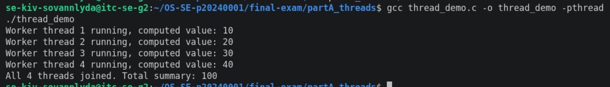
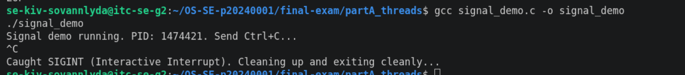
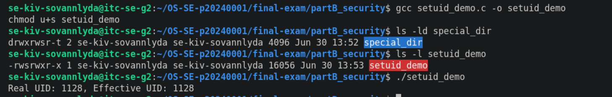
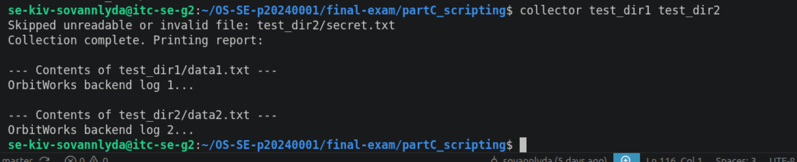
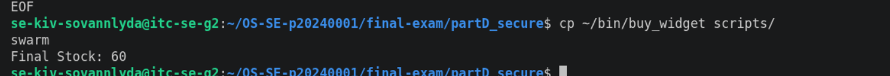
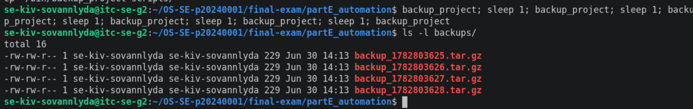

# Final Exam — Kiv Sovannlyda

<!-- ===== COVER SHEET — required first section. Fill EVERY line. ===== -->
```
Student name: Kiv Sovannlyda
Student ID: p20240001
Server username: se-kiv-sovannlyda
Exam scenario value (COMPANY / PRODUCT): Techcorp
Date & start time: 30/06/2024, start time: 1:00 PM
AI assistant used (name/none): Gemini
```

> Exact commands per part are in `commands.md`. Live-curveball answers are in `live_mods.md`.
> Replace every `<...>` below. Keep answers tied to **your own** scenario numbers.

---

## Part A — Threads, Kernel Mapping & Signals

**Screenshots**




**Written (one short answer):** Threads share the same memory space, so the parent can directly read the joined result, while a forked child gets an isolated copy of the parent's memory, so its changes don't affect the parent

- **Why does a worker thread's joined result reach the main thread, but a forked
  child's value would not?**
  
  <threads share one address space (joined value read from shared memory); a forked
  child runs in a copied address space, so its changes never reach the parent>

**Anything not completed:** none 

---

## Part B — Files, Permissions & Special Bits

**Screenshot**



**Written (one short answer):** Translate your private file's final octal mode into the 9-char symbolic string
  `600` translates to `rw-------`

- **Translate your private file's final octal mode into the 9-char symbolic string**
  (e.g. `600` → `rw-------`).
  octal `<NNN>` → `<rwx-style>`

**Anything not completed:** none 

---

## Part C — Bash Scripting, PATH & Safe File Scanning

**Screenshot**



**Written (one short answer):** The shell only searches for executable commands in the directories listed in the `$PATH` environment variable and by adding `~/bin` allowed the shell to resolve the bare name `greeter`

- **Why did `greeter` fail to run by name before you added your `bin` directory to
  PATH?**
  <the shell only searches directories listed in $PATH; adding ~/bin let it resolve the
  bare name `greeter`>

**Anything not completed:** none 

---

## Part D — Concurrency, a Race Condition & File Locking

**Screenshot**



**Written (one short answer):** Due to a race condition, multiple concurrent bots read the same initial stock value at the exact same time, subtracted 1 in memory, and simultaneously overwrote each other's decrements when saving 99 back to the file

- **Why did the unpatched `swarm` sometimes leave more stock than the correct final
  value (with `<INITIAL_STOCK>` stock and `<SWARM_SIZE>` concurrent buyers)?**
  <concurrent buyers read the same stale stock (lost update), so some decrements
  overwrote each other — fewer than expected applied>

**Anything not completed:** none

---

## Part E — Backups, Archiving & cron Automation

**Screenshot**



**Written (one short answer):** Compression (`gzip`) actually shrank the bytes by identifying and removing redundant data patterns and archiving (`tar`) simply bundled multiple files together into a single container without reducing the total file size

- **Archiving vs compression — which one actually shrank the bytes, and why?**
  <tar archives (bundles) many files into one; gzip/compression shrinks bytes —
  compression reduced the size>

**Anything not completed:** none
