# Class Activity 1 — System Calls in Practice

- **Student Name:** Kiv Sovannlyda
- **Student ID:** p20240001
- **Date:** 20/03/2026

---

## Warm-Up: Hello System Call

Screenshot of running `hello_syscall.c` on Linux:

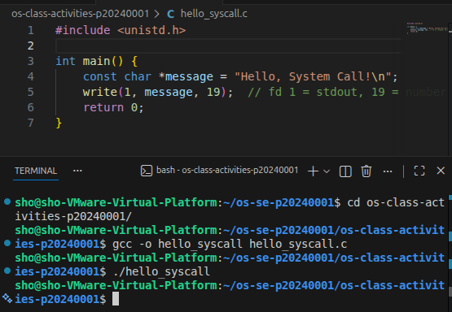

Screenshot of running `hello_winapi.c` on Windows (CMD/PowerShell/VS Code):

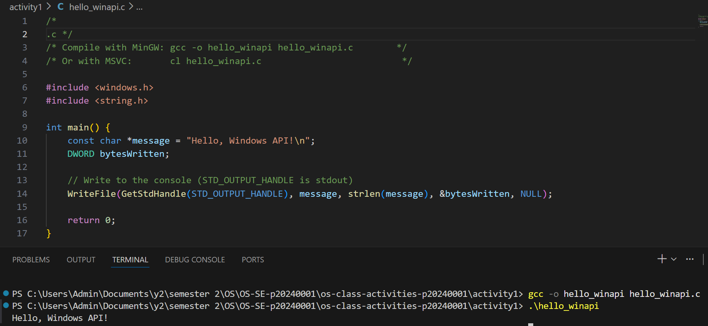

Screenshot of running `copyfilesyscall.c` on Linux:

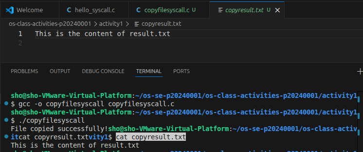

---

## Task 1: File Creator & Reader

### Part A — File Creator

**Describe your implementation:** [What differences did you notice between the library version and the system call version?]

> The library version was straightforward because with just a few function calls and everything worked. The system call version made me think more carefully about what was actually happening, like specifying exactly how to open the file and how many bytes to write.

**Version A — Library Functions (`file_creator_lib.c`):**

<!-- Screenshot: gcc -o file_creator_lib file_creator_lib.c && ./file_creator_lib && cat output.txt -->
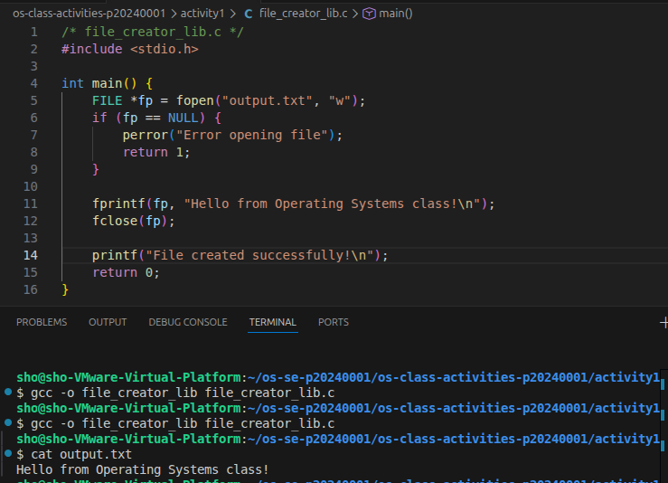

**Version B — POSIX System Calls (`file_creator_sys.c`):**

<!-- Screenshot: gcc -o file_creator_sys file_creator_sys.c && ./file_creator_sys && cat output.txt -->
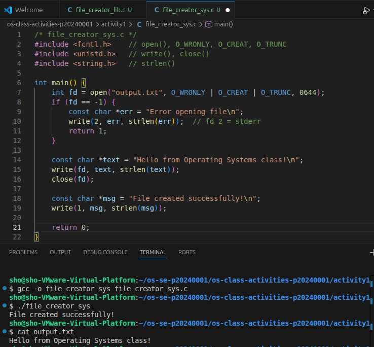

**Questions:**

1. **What flags did you pass to `open()`? What does each flag mean?**

   > O_WRONLY is used to open the file for writing only, O_CREAT is to create the file if it does not already exist and O_TRUNC erase the file contents if it already exists so you start afresh

2. **What is `0644`? What does each digit represent?**

   > 0644 is an octal permission number, each digit represent: 
    0 = octal prefix 
    6 (owner) = read + write 
    4 (group) = read only 
    4 (others) = read only.

3. **What does `fopen("output.txt", "w")` do internally that you had to do manually?**

   > fopen() automatically calls open() with the correct flags, allocates a FILE struct, and sets up an internal memory buffer.

### Part B — File Reader & Display

**Describe your implementation:** 

> 

**Version A — Library Functions (`file_reader_lib.c`):**

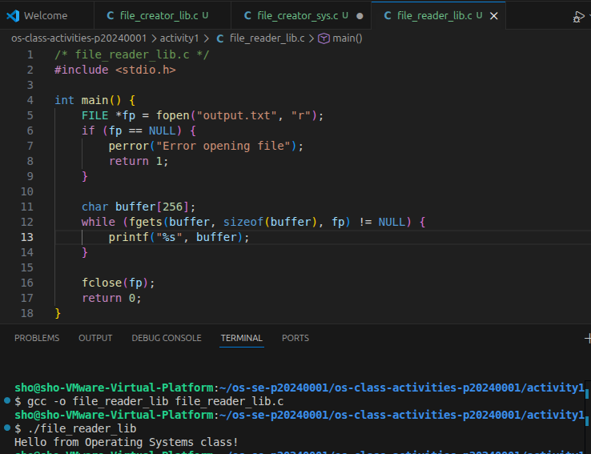

**Version B — POSIX System Calls (`file_reader_sys.c`):**

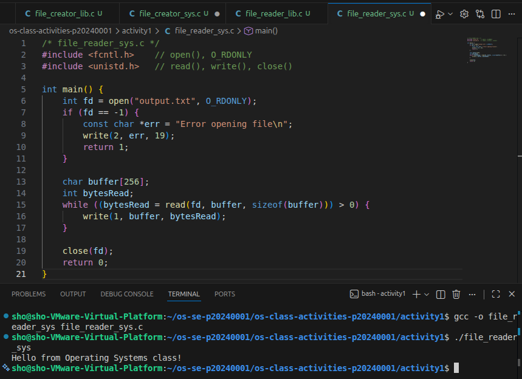

**Questions:**

1. **What does `read()` return? How is this different from `fgets()`?**

   > read() returns an integer and a positive number means how many bytes were read, 0 means end of file, and -1 means an error occurred. fgets() is higher level and returns either a pointer to the buffer on success or NULL on end of file or error. 

2. **Why do you need a loop when using `read()`? When does it stop?**

   > read() only reads up to sizeof(buffer) bytes per call. If the file is larger than your buffer, one call will not get everything. The loop keeps reading chunks until read() returns 0, which signals end of file.

---

## Task 2: Directory Listing & File Info

**Describe your implementation:** [Your notes]

### Version A — Library Functions (`dir_list_lib.c`)

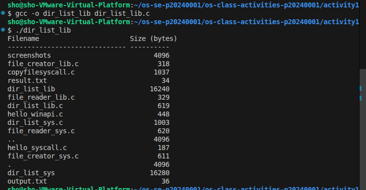

### Version B — System Calls (`dir_list_sys.c`)

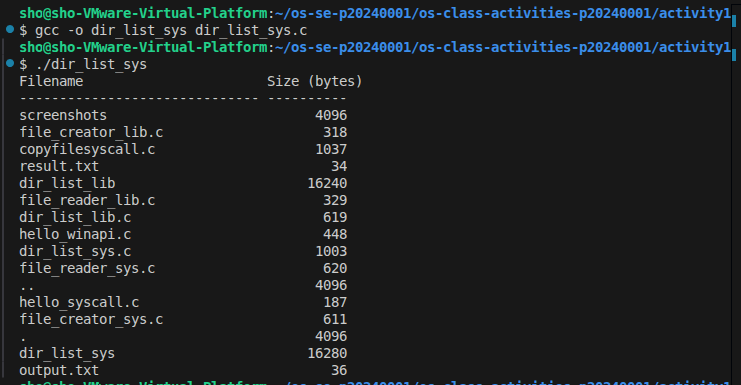

### Questions

1. **What struct does `readdir()` return? What fields does it contain?**

   > It returns a pointer to a struct dirent, it contains fields like: d_name, d_ino, d_type and d_reclen

2. **What information does `stat()` provide beyond file size?**

   > stat() provides file permissions, owner user and group ID, number of hard links, and timestamps for when the file was last accessed, modified, and changed.

3. **Why can't you `write()` a number directly — why do you need `snprintf()` first?**

   > We need `snprintf()` first because write() only sends raw bytes while snprintf() converts the number into readable characters first so that when write() sends it to the terminal it actually displays correctly.

---

## Optional Bonus: Windows API (`file_creator_win.c`)

Screenshot of running on Windows:

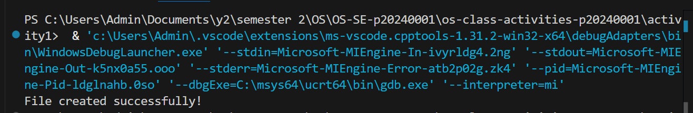

### Bonus Questions

1. **Why does Windows use `HANDLE` instead of integer file descriptors?**

   > HANDLE can refer to many different things like files, threads, and processes all through one type. Linux just uses plain integers to keep it simple.

2. **What is the Windows equivalent of POSIX `fork()`? Why is it different?**

   > The equivalent is CreateProcess(). fork() clones the currently running process while CreateProcess() starts a completely new one from scratch. They both create new processes but in very different ways.

3. **Can you use POSIX calls on Windows?**

   > Not natively, but tools like WSL make it possible by running Linux inside Windows so without something like WSL it won't work because Windows and Linux use completely different system call interfaces.

---

## Task 3: strace Analysis

**Describe what you observed:** [What surprised you about the strace output? How many more system calls did the library version make?]

> I didn't expect so many system calls to happen before my actual code even ran. Seeing the library version make nearly 10 times more calls than the system call version for such a simple program was unexpected.

### strace Output — Library Version (File Creator)

<!-- Screenshot: strace -e trace=openat,read,write,close ./file_creator_lib -->
<!-- IMPORTANT: Highlight/annotate the key system calls in your screenshot -->
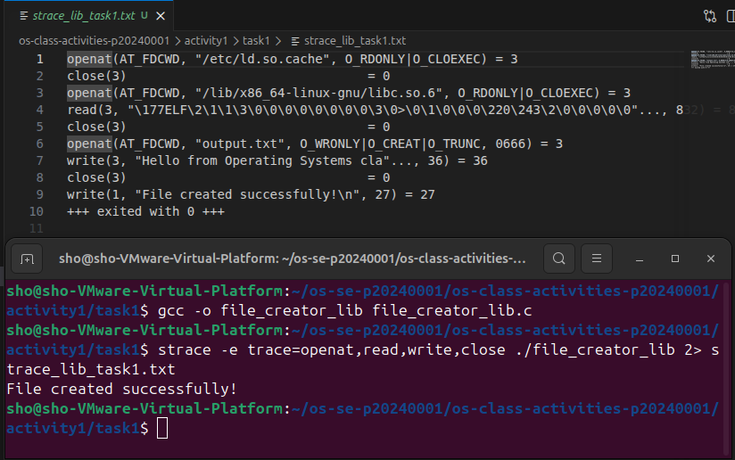

### strace Output — System Call Version (File Creator)

<!-- Screenshot: strace -e trace=openat,read,write,close ./file_creator_sys -->
<!-- IMPORTANT: Highlight/annotate the key system calls in your screenshot -->
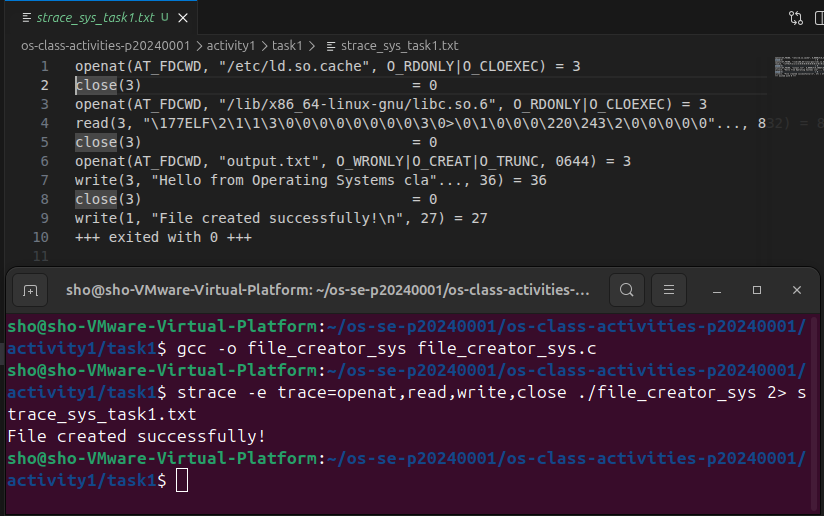

### strace Output — Library Version (File Reader or Dir Listing)

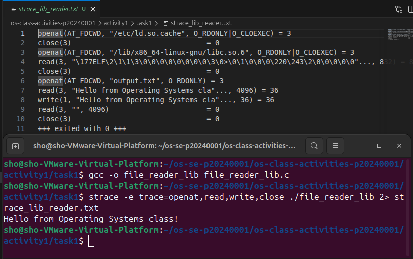

### strace Output — System Call Version (File Reader or Dir Listing)

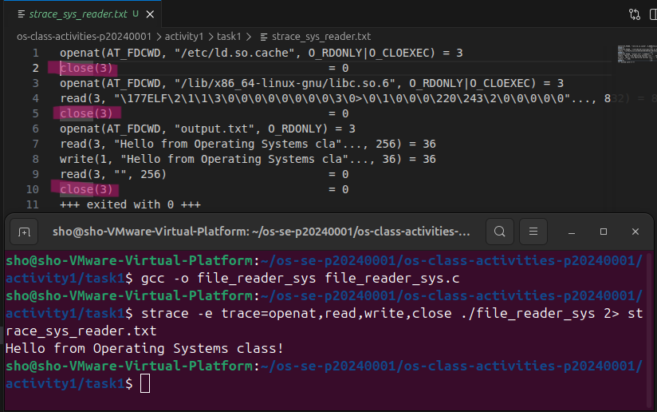

### strace -c Summary Comparison

<!-- Screenshot of `strace -c` output for both versions -->
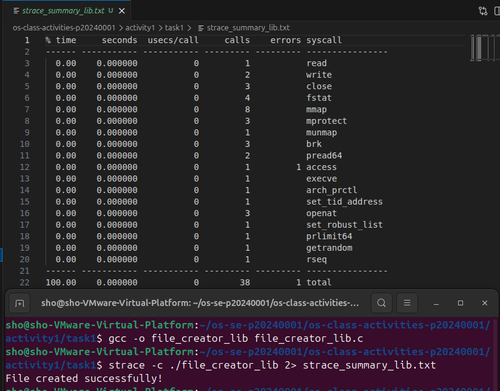
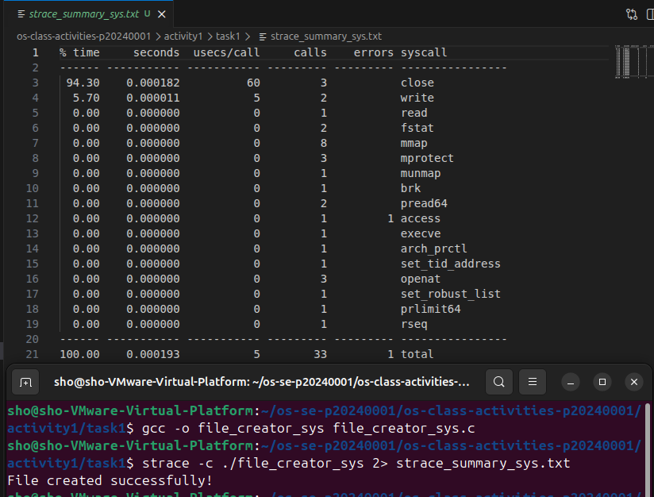

### Questions

1. **How many system calls does the library version make compared to the system call version?**

   > The lib version made 38 calls while the sys call only made 33 calls so that's 5 less than the lib version

2. **What extra system calls appear in the library version? What do they do?**

   > mmap() maps the C library into memory before the program runs. brk() adjusts the heap size to make room for stdio buffers. fstat() checks the file's metadata internally when fopen() is called 

3. **How many `write()` calls does `fprintf()` actually produce?**

   > Just one, even though fprintf() was called once, it buffers the output internally and only flushes it to the kernel in a single write() call at the end.

4. **In your own words, what is the real difference between a library function and a system call?**

   > The real difference between a lib function and a sys call is that a system call goes directly to the kernel to get something done, while a library function is just C code that runs in your program and eventually calls a system call underneath. 

---

## Task 4: Exploring OS Structure

### System Information

> 📸 Screenshot of `uname -a`, `/proc/cpuinfo`, `/proc/meminfo`, `/proc/version`, `/proc/uptime`:

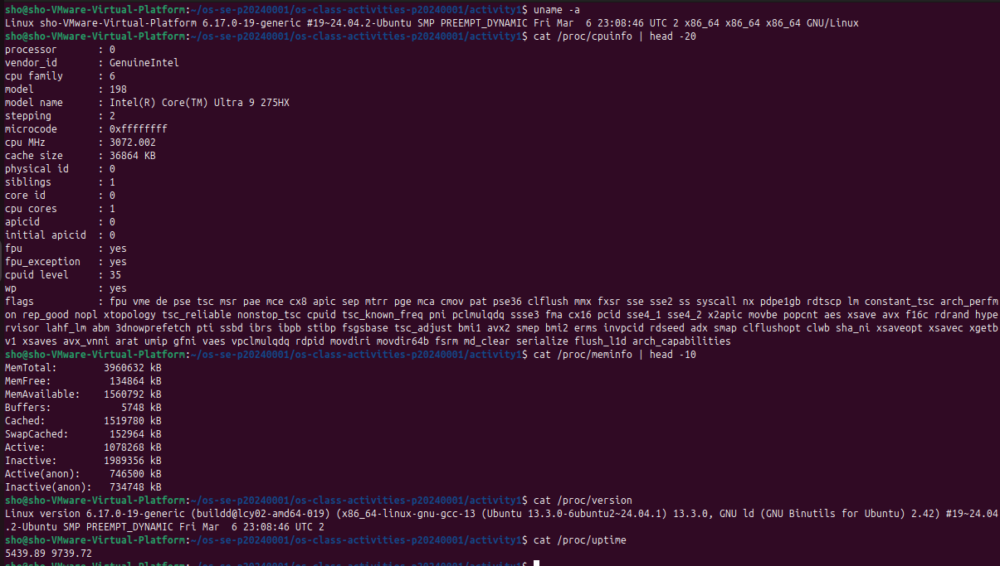

### Process Information

> 📸 Screenshot of `/proc/self/status`, `/proc/self/maps`, `ps aux`:

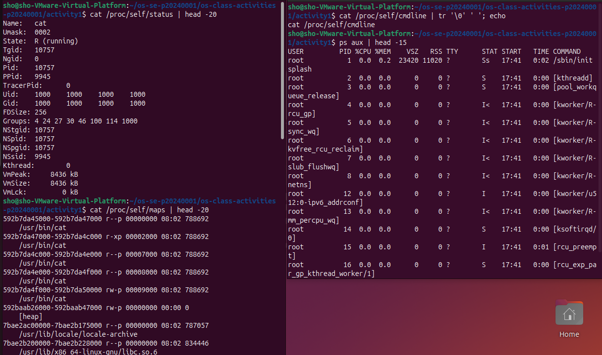

### Kernel Modules

> 📸 Screenshot of `lsmod` and `modinfo`:

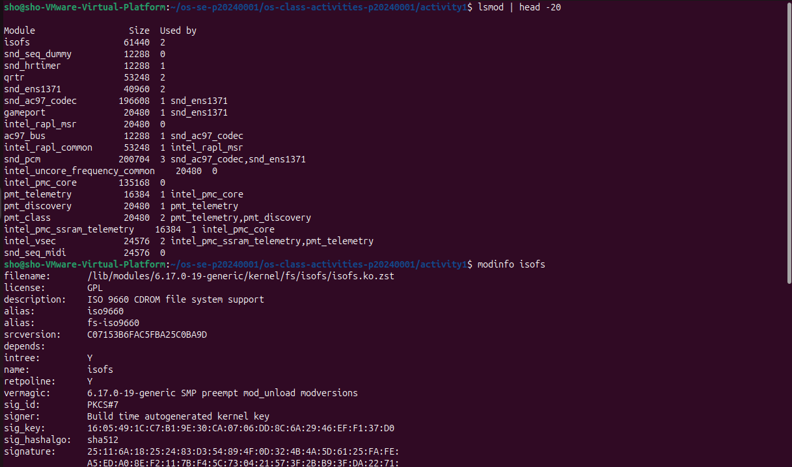

### OS Layers Diagram

> 📸 Your diagram of the OS layers, labeled with real data from your system:

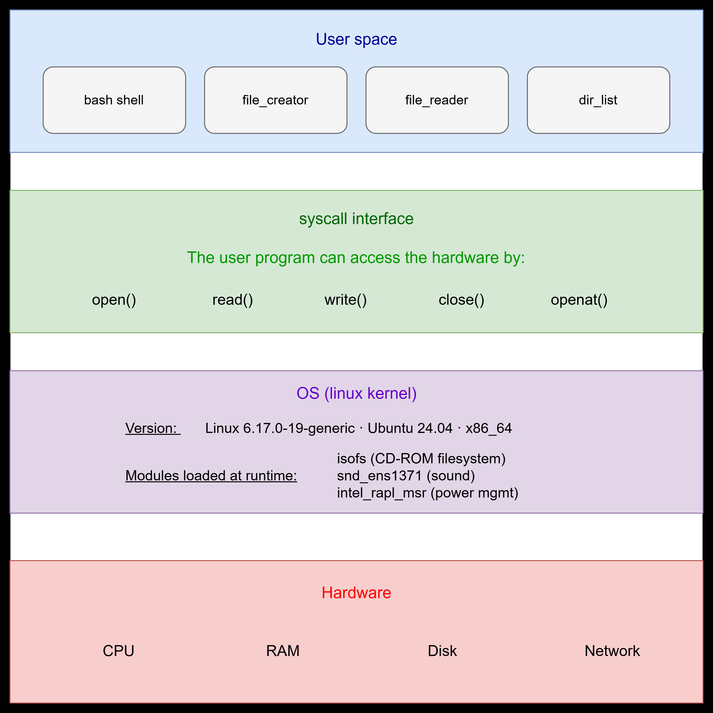

### Questions

1. **What is `/proc`? Is it a real filesystem on disk?**

   > /proc is a virtual filesystem that doesn't exist on disk. The kernel generates its contents on the fly to give user programs a window into its internal state.

2. **Monolithic kernel vs. microkernel — which type does Linux use?**

   > A monolithic kernel runs everything in kernel space while a microkernel runs only the minimum there. Linux is a monolithic kernel but with loadable modules that can be added or removed at runtime.

3. **What memory regions do you see in `/proc/self/maps`?**

   > You can see the shared C library, the heap for dynamic memory, the stack for local variables, and a vdso region which is a kernel shortcut for faster system calls.

4. **Break down the kernel version string from `uname -a`.**

   > It tells you the kernel version, the machine hostname, the distro it was built for, whether it supports multiple CPU cores, and the CPU architecture.

5. **How does `/proc` show that the OS is an intermediary between programs and hardware?**

   > When you read a file in /proc, your program never touches the hardware directly. The kernel intercepts the request, queries the hardware itself, and returns the result as readable text

---

## Reflection

What did you learn from this activity? What was the most surprising difference between library functions and system calls?

> I learned that library functions like fopen() and printf() are just a cleaner way of calling the same system calls I was writing manually. Before this activity I never really thought about what was happening. The most surprising part was using strace and seeing how many extra system calls the library version made compared to mine and so many things were happening, I just never knew.