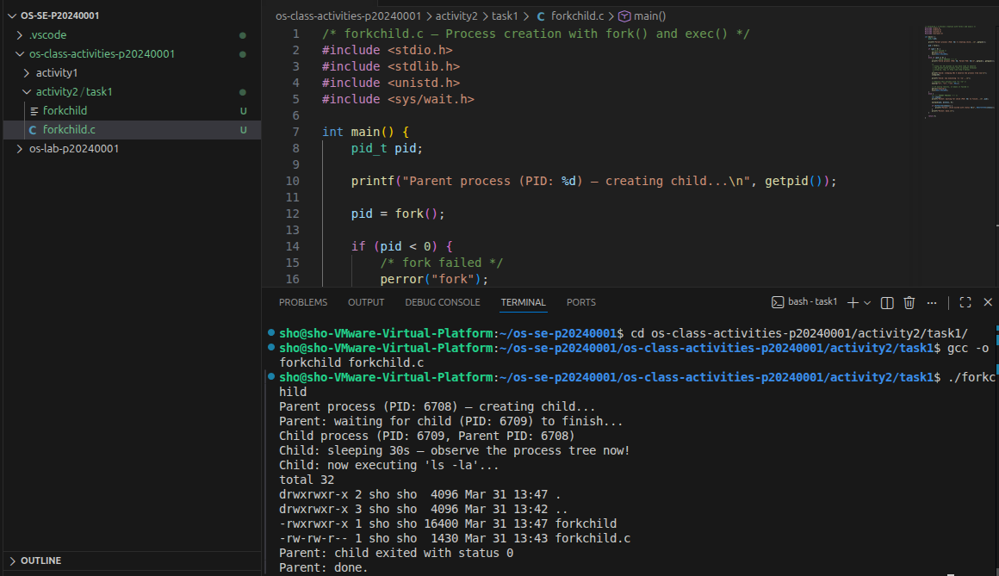
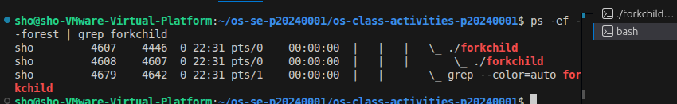
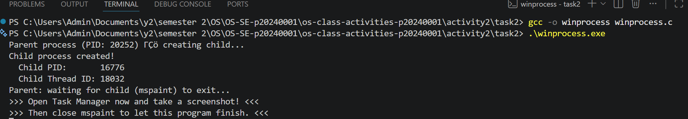
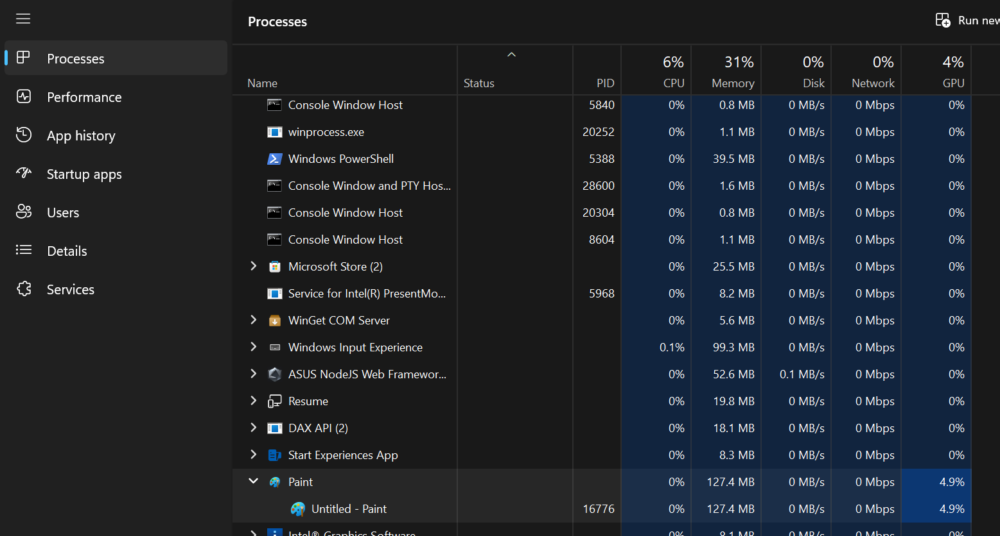
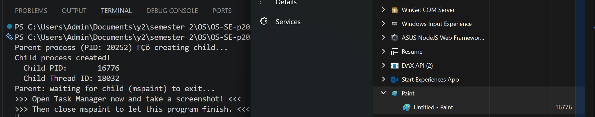
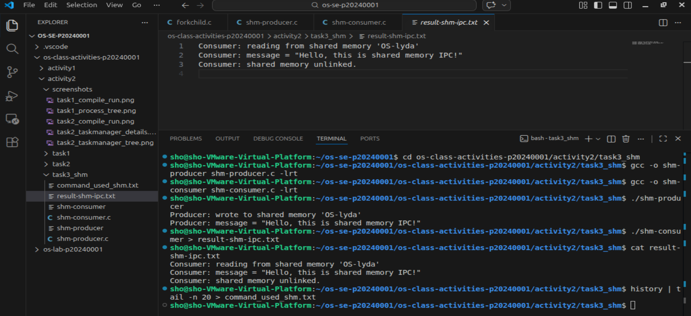
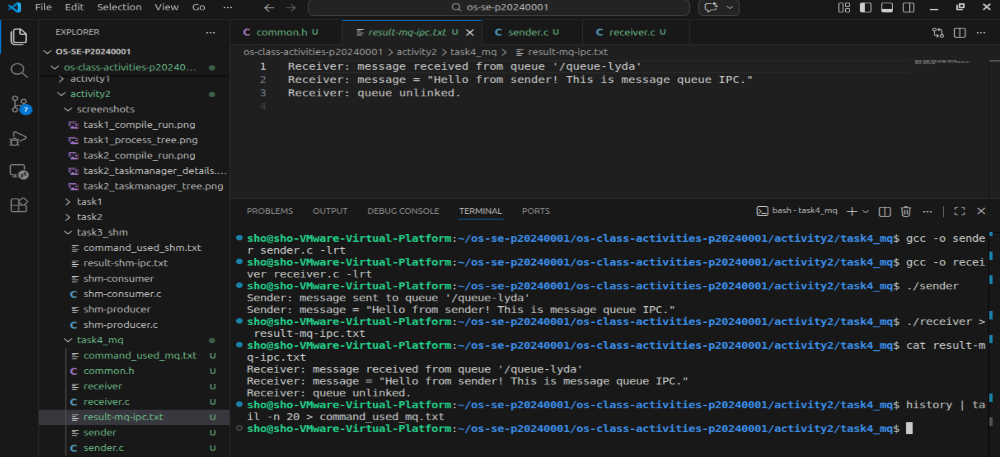

# Class Activity 2 — Processes & Inter-Process Communication

- **Student Name:** Kiv Sovannlyda
- **Student ID:** p20240001
- **Date:** 31/03/2024

---

## Task 1: Process Creation on Linux (fork + exec)

### Compilation & Execution

Screenshot of compiling and running `forkchild.c`:



### Process Tree

Screenshot of the parent-child process tree (using `ps --forest`, `pstree`, or `htop` tree view):



### Output

```
total 32
drwxrwxr-x 2 sho sho  4096 Mar 31 13:49 .
drwxrwxr-x 3 sho sho  4096 Mar 31 13:42 ..
-rwxrwxr-x 1 sho sho 16400 Mar 31 13:47 forkchild
-rw-rw-r-- 1 sho sho  1430 Mar 31 13:43 forkchild.c
-rw-rw-r-- 1 sho sho     0 Mar 31 13:49 result_forkchild.txt
Parent process (PID: 7040) — creating child...
Parent: waiting for child (PID: 7041) to finish...
Parent: child exited with status 0
Parent: done.

```

### Questions

1. **What does `fork()` return to the parent? What does it return to the child?**

   > fork() returns the child's PID to the parent and it returns 0 to the child

2. **What happens if you remove the `waitpid()` call? Why might the output look different?**

   > The parent exits immediately without waiting, so the child becomes a zombie process and the output might look different because the processes run at the same time

3. **What does `execlp()` do? Why don't we see "execlp failed" when it succeeds?**

   > execlp() replaces the child process with a new program and we don't see "execlp failed" when it succeeds because when we succeed, the original code from the memory is gone

4. **Draw the process tree for your program (parent → child). Include PIDs from your output.**

   ```
      forkchild (PID: 7040) ← parent
         └── forkchild (PID: 7041) ← child
   ```
    
5. **Which command did you use to view the process tree (`ps --forest`, `pstree`, or `htop`)? What information does each column show?**

   > I used ps --forest and each column shows PID, TTY, and command

---

## Task 2: Process Creation on Windows

### Compilation & Execution

Screenshot of compiling and running `winprocess.c`:



### Task Manager Screenshots

Screenshot showing process tree in the **Processes** tab (mspaint nested under your program):



Screenshot showing PID and Parent PID in the **Details** tab:



### Questions

1. **What is the key difference between how Linux creates a process (`fork` + `exec`) and how Windows does it (`CreateProcess`)?**

   > The key difference between them is that fork() duplicates the process then exec() replaces it, while CreateProcess() directly launch the target executable.

2. **What does `WaitForSingleObject()` do? What is its Linux equivalent?**

   > It blocks the parent until the child process finishes and its linux equivalance is waitpid()

3. **Why do we need to call `CloseHandle()` at the end? What happens if we don't?**

   > It releases the kernel handles for the child process and thread so if we don't call it then those handles leak and the OS keeps wasting resources tracking objects we no longer need.

4. **In Task Manager, what was the PID of your parent program and the PID of mspaint? Do they match your program's output?**

   > The PID in my parent program was 16776 and the PID od mspaint is also 16776 so they match

5. **Compare the Processes tab (tree view) and the Details tab (PID/PPID columns). Which view makes it easier to understand the parent-child relationship? Why?**

   > I think the tree is easier to understand because i can see visibly that mspaint is nested underneath the parent so it's clearer to me.

---

## Task 3: Shared Memory IPC

### Compilation & Execution

Screenshot of compiling and running `shm-producer` and `shm-consumer`:



### Output

```
Consumer: reading from shared memory 'OS-lyda'
Consumer: message = "Hello, this is shared memory IPC!"
Consumer: shared memory unlinked.

```

### Questions

1. **What does `shm_open()` do? How is it different from `open()`?**

   > It creates a named memory region in RAM (under /dev/shm) and unlike open(), nothing is written to disk so it's faster

2. **What does `mmap()` do? Why is shared memory faster than other IPC methods?**

   > It maps the shared memory into the process's address space so we can access it like a normal pointer and tt's faster than other IPC methods because data is never copied, it access the same memory directly

3. **Why must the shared memory name match between producer and consumer?**

   > It's how the OS knows both processes are referring to the same object so if it's different then it won't share anything

4. **What does `shm_unlink()` do? What would happen if the consumer didn't call it?**

   > It removes the shared memory object from the system so if it's not called then the object stays in /dev/shm even after both processes exit and waste memory

5. **If the consumer runs before the producer, what happens? Try it and describe the error.**

   > shm_open() fails with "No such file or directory" since the producer hasn't created the object yet and then there's even a hint that prints out if it gets an error:  "Hint: Did you run shm-producer first?"

---

## Task 4: Message Queue IPC

### Compilation & Execution

Screenshot of compiling and running `sender` and `receiver`:



### Output

```
Receiver: message received from queue '/queue-lyda'
Receiver: message = "Hello from sender! This is message queue IPC."
Receiver: queue unlinked.

```

### Questions

1. **How is a message queue different from shared memory? When would you use one over the other?**

   > Shared memory gives you a raw pointer with no structure but it's faster while message queues are kernel-managed with built-in ordering and blocking. We use shared memory for speed, message queues when you need structured or asynchronous messaging.

2. **Why does the queue name in `common.h` need to start with `/`?**

   > It needs to start with it because POSIX requires it, as the / puts the name in the IPC namespace 

3. **What does `mq_unlink()` do? What happens if neither the sender nor receiver calls it?**

   > It deletes the queue from the kernel and if nobody calls it, the queue persists after both processes exit

4. **What happens if you run the receiver before the sender?**

   > mq_open() fails with "No such file or directory" and then there's even a hint that prints out if it gets an error:  "Hint: Did you run sender first?"

5. **Can multiple senders send to the same queue? Can multiple receivers read from the same queue?**

   > Yes, they can but each message goes to only one receiver, not all of them.

---

## Reflection

What did you learn from this activity? What was the most interesting difference between Linux and Windows process creation? Which IPC method do you prefer and why?

> I learnt that GRUB customization is really frustrating and complicated. The most interesting difference is that Linux uses 2 commands like fork() + exec() while Window uses one command CreateProcess(). For the IPC method, I prefer the message queues more since timing between sender and receiver matters less even if shared memory is faster, i think message queues are more beginner-friendly