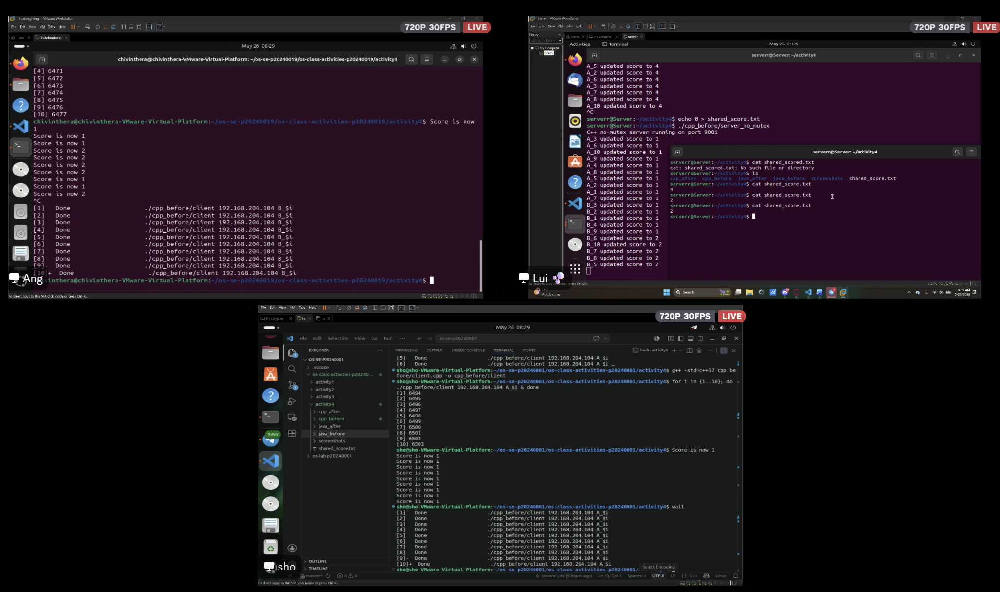
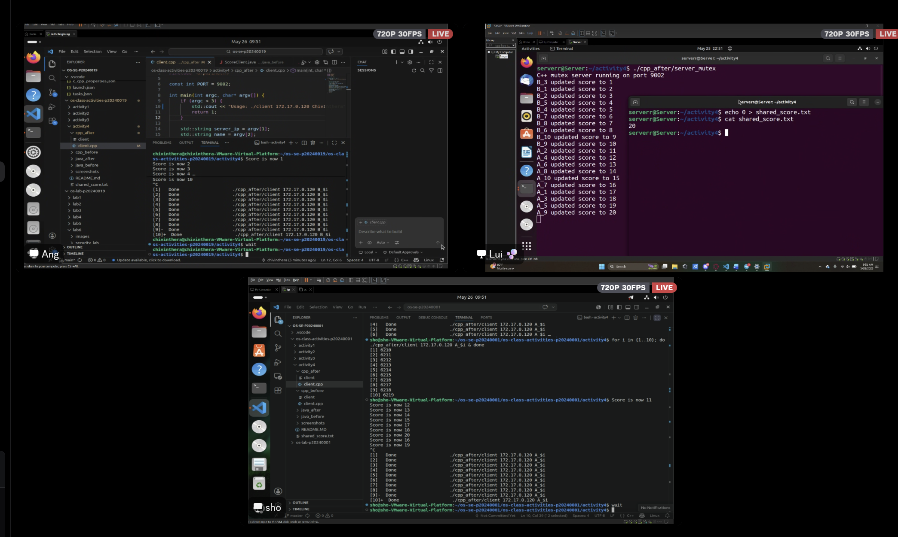
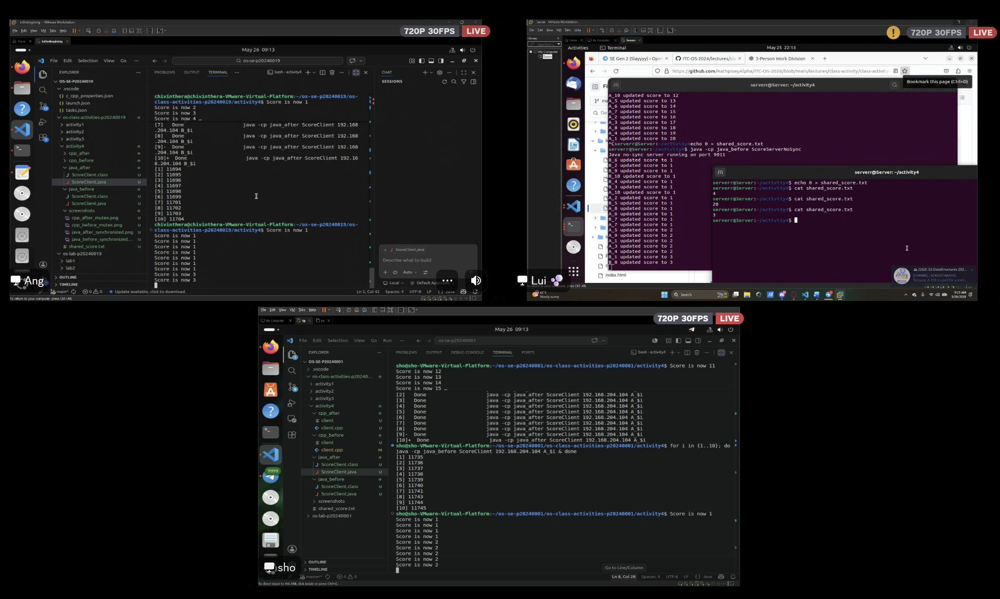
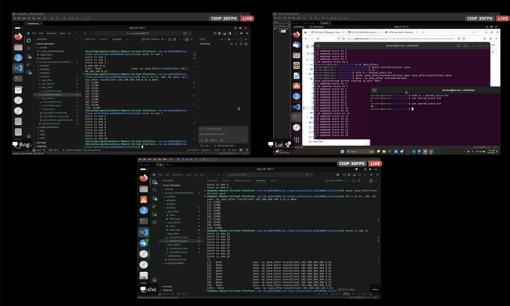

# Class Activity 4 — Shared File API

- **Student Name:** Kiv Sovannlyda
- **Student ID:** p20240001
- **Partner Name:** Chiv Inthera
- **Partner Student ID:** p20240019
- **Server Machine Owner:** Hen Chhordavattey 
- **Server IP Address:** 192.168.204.104

---

## Task 1: C++ Before Mutex

- Expected score after 20 total client requests:
- Actual score: 2
- What happened: Multiple client threads updated the shared file at the same time without synchronization, making some updates overwrite each other and caused a race condition and making the final score incorrect

---

## Task 2: C++ After Mutex

- Expected score after 20 total client requests:
- Actual score: 20
- What changed after adding mutex: The mutex allowed only one thread at a time to access and update the shared file which prevented race conditions and made the final score consistent and correct

---

## Task 3: Java Before Synchronized

- Expected score after 20 total client requests:
- Actual score: 3
- What happened: Multiple threads accessed the shared file simultaneously without synchronizatio so some updates were lost because threads read and wrote the file at the same time

---

## Task 4: Java After Synchronized

- Expected score after 20 total client requests:
- Actual score: 20 
- What changed after adding synchronized: The synchronized method ensured that only one thread could update the file at a time and this protected the shared resource and prevented race conditions

---

## Questions

1. Why should clients send requests to the server instead of writing the file directly?
>  Clients should send requests to the server because the server controls access to the shared file so it can reduce conflicts and keeps the file updates organized and secur

2. Why does the server still have a race condition before mutex or synchronized?
>  The server creates multiple threads to handle clients, without synchronization, several threads may read and write the file at the same time, causing lost updates

3. In the C++ fixed version, what does `std::lock_guard<std::mutex>` protect?
>  It protects the critical section where the server reads, updates, and writes the shared file

4. In the Java fixed version, what does `synchronized` protect?
>  It protects the updateScore method so that only one thread can execute it at a time

5. Why is the final score expected to be 20 when Student A sends 10 requests and Student B sends 10 requests?
>  Each request increases the score by 1 and since there are 20 total requests, the final score should be 20.

6. What could happen if two separate servers update the same file at the same time?
>  The servers could overwrite each other’s updates, causing incorrect or corrupted data due to race conditions

---

## Reflection

_Compare the C++ and Java synchronization approaches. What did this activity teach you about protecting shared resources?_

> This activity showed how race conditions happen when multiple threads access the same file at the same time. In C++, we used `mutex`, while Java used `synchronized` to prevent this problem, but both methods helped make the final result correct and consistent.