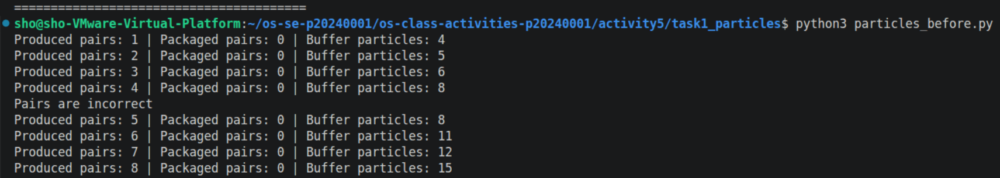
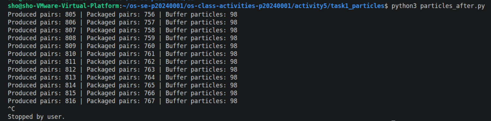
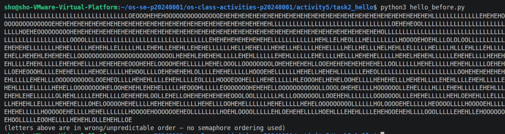

# Class Activity 5 - Semaphores

- **Student Name:** Kiv Sovannlyda
- **Student ID:** p20240001
- **Programming Language Used:** Python 

---

## Task 1A: Particle Pair Buffer Before Semaphores

- What error or incorrect behavior appeared: the errors that appeared are pairs are incorrect and the producing machine is broken

- Why did this happen without semaphore protection: because multiple producer threads were adding particles at the same time with no coordination, so p1 from one machine ended up next to p2 from a different machine and the buffer just kept filling up with nobody controlling access

---

## Task 1B: Particle Pair Buffer After Semaphores

- Number of producer machines:3
- Buffer capacity: 100 particles (50 pairs)
- Semaphores used: empty_pairs (50) full_pairs (0) mutex (1)
- Produced pair count shown in screenshot: 816
- Packaged pair count shown in screenshot: 767
- Did any error appear during normal operation?: no

---

## Task 2A: HELLO Before Semaphores

- Output before semaphore ordering: scrambled letters, it didn't spell out HELLO in an organized way 

- Why this output can be wrong or unpredictable: because all three threads start at the same time and the cpu can switch between them whenever it wants so theres no guarantee which one runs first

---

## Task 2B: HELLO After Semaphores

- Processes or threads used: 3 threads process1 process2 process3
- Semaphores used: a = 1 b = 0 c = 0
- Final output: HELLO

---

## Questions

1. In Task 1, why does a producer need to wait before adding a pair to the buffer?

> They need to wait because the buffer has limited space and if a producer just adds without checking it will overflow and corrupt the data

2. In Task 1, why does the consumer need to wait before removing a pair from the buffer?

> They need to wait because if the buffer is empty and the consumer tries to fetch it will crash since there is nothing to take

3. Which semaphore protects the critical section in your particle buffer program?

> The semaphore that does that is the mutex semaphore with initial value 1 makes sure only one thread touches the buffer at a time

4. How does your program verify that `P1` and `P2` belong to the same pair?

> Each particle is named like M2-17-P1 and M2-17-P2 so we just strip the P1 and P2 part and check if the base names match

5. In Task 2, why can the program print letters in the wrong order without semaphores?

> All three threads start at the same time and the OS can run them in any order so the letters come out randomly

6. Which semaphore or synchronization step forces `H` to print before `E`, `L`, `L`, and `O`?

> Semaphore a starts at 1 so only process 1 can go first and since H and E are printed in the same thread H always comes before E then b and c chain the rest in order

7. What could cause deadlock in either of your simulations?

> In task 1, if a producer grabs the mutex and then waits for empty pairs while the consumer is also waiting for the mutex they block each other forever, and in task 2 if process 2 waited on itself without ever releasing it would be stuck forever

---

## Reflection

_What did these simulations teach you about using semaphores for shared resources and ordered execution?_

> This activity taught me of how complicated semaphores are, but task 1 taught me how counting semaphores act like a gatekeeper for shared resources, and task 2 showed me how we can use semaphores just to control the order things happen like that HELLO task. 