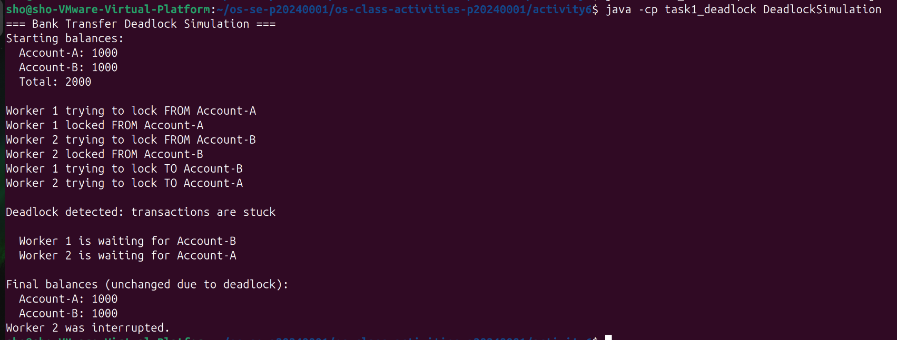
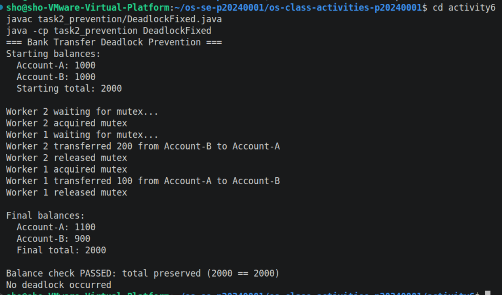

# Class Activity 6 - Deadlock Simulation

- **Student Name:** Kiv Sovannlyda
- **Student ID:** p20240001
- **Programming Language Used:** Java 

---

## Task 1: Deadlock Version



- Shared resources: Account-A and Account-B
- Transaction 1: Transfer 100 from Account-A to Account-B
- Transaction 2: Transfer 200 from Account-B to Account-A
- Deadlock message shown: ```Deadlock detected: transactions are stuck```
- Explanation of why the program got stuck: Worker 1 locked Account-A and Worker 2 locked Account-B and then Worker 1 tried to lock Account-B and Worker 2 tried to lock Account-A at the same time. Both were waiting on each other so neither could continue so the balances stayed at 1000 each since no transfer completed.

---

## Task 2: Deadlock Prevention Version



- Prevention strategy used: One shared semaphore mutex wrapping the entire transfer operation
- Semaphore mutex initial value: 1
- Starting total: 2000
- Final total: 2000
- Did both transfers complete?: Yes since Worker 2 transferred 200 from Account-B to Account-A, and then Worker 1 transferred 100 from Account-A to Account-B
- Why no deadlock occurred: Because only one worker could hold the mutex at a time, so Worker 1 had to wait while Worker 2 finished completely before it could even start

---

## Questions

1. What are the two shared resources in your bank transaction simulation?

> Account-A and Account-B since both threads need access to both accounts to complete a transfer

2. Which line or section of your Task 1 program creates hold-and-wait?

> The part where a worker calls from.lock.acquire(), then sleeps, then calls to.lock.acquire()

3. How does Task 1 create circular wait?

> Worker 1 holds Account-A and waits for Account-B. Worker 2 holds Account-B and waits for Account-A

4. Why does the Task 1 program need a watchdog or timeout?

> It needs one because deadlocked threads just freeze silently, so without a watchdog, the program hangs forever and you'd have no idea if it deadlocked or was just slow

5. How does the single semaphore mutex prevent deadlock in Task 2?

> Only one worker can enter the transfer at a time, so the second worker waits at the door holding nothing, so there's no situation where both are stuck holding one lock and waiting for another

6. Which of the four deadlock conditions does your Task 2 solution remove or avoid?

> It removes hold-and-wait since a thread doesn't hold anything while waiting for the mutex

7. Why must the final total bank balance remain unchanged after both transfers?

> Money is just moving between two accounts, not created or destroyed, so if the total changes, it means a balance update was lost or applied twice which means there's a bug


---

## Reflection

_What did this activity teach you about deadlock prevention in real systems such as banking, databases, or file systems?_

> This activity taught me that timing matters becuase just because two threads ran at the same time it ended up freezing each other, it showed me the importance of deadlock prevention because if this was real then there would be issues with people's actual money


