# Class Activity 7 - Reasoning About Deadlock

- Student Name: Kiv Sovannlyda
- Student ID: p20240001
- My personalization: a = 1, b = 0

---

## Task 1 — Resource Allocation Graphs

### Part A
Graph 1 — my prediction: I think there is a cycle and it will be deadlocked, the path would be R0 -> P0 -> R1 -> P1 -> R2 -> P2 -> R0
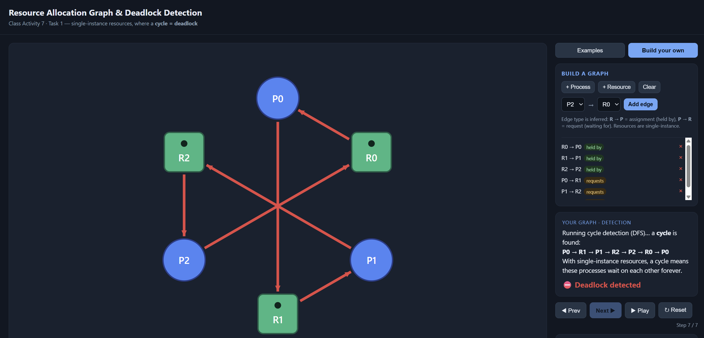
Matched the tool? Yes, it matched the tool 

Graph 2 — my prediction: I think there won't be a cycle and therefore no deadlock because the R0 is held by P0 and P0 waits on R1, P1 waits on R2 and R2 is held on by P2 but P2 doesn't wait on anything so there's no cycle
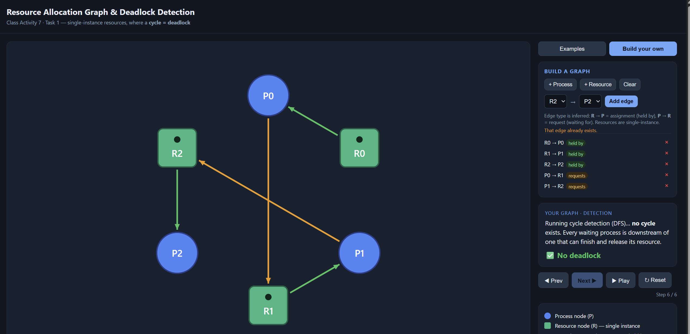
Matched the tool? Yes, it matched the tool

### Part B
(i) Deadlocked 3×3 graph — edges I used + why it deadlocks:
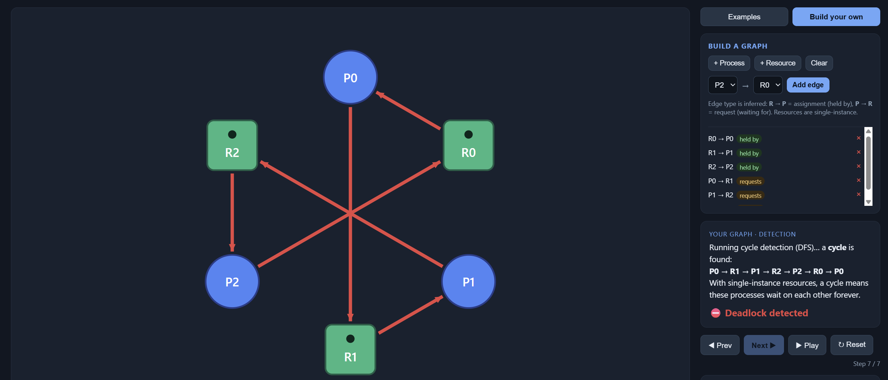

(ii) No-cycle graph (≥4 nodes, ≥1 request) — why it is deadlock-free: It's deadlock-free because i let R0 be held by P0 and P0 is waiting on R1 but since R1 is free so then it can finish immediately and continue onto P1 that is waiting on R0 but since it was held on by P0 before and now it's free so there's no cycle
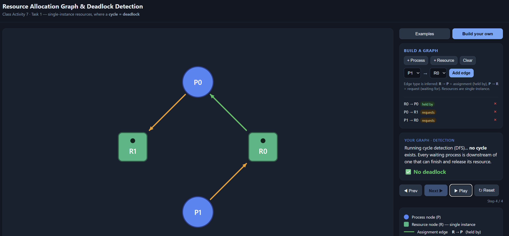

---

## Task 2 — Cycle ≠ Deadlock

Warm-up (built-in examples)
1. Why the "Cycle, NO deadlock" example is not deadlocked: It's not deadlocked because although there is a cycle, each resource has more than 1 instances so even if one is taken then the other one is available so the it can complete and not be stuck in a cycle
2. The single change that causes deadlock: The single change that made it deadlock is because there are no remaining requests that ≤ work therefore they are deadlocked

Part A — given scenario
- Available = Total − ΣAlloc = (2-2, 1-1, 2-2) = (0, 0, 0)
- The cycle (as a path): P1 -> R2 -> P2 -> R1 -> P1   Process in the cycle that can still finish + why: P2 is in the cycle but it can still finish because P3 finishes first and release R1 

| Step | Process | Why Request ≤ Work | Work after release |
|------|---------|--------------------|--------------------|
| 1 | P3| [0, 0, 0] ≤ [0, 0, 0]| [1, 0, 1]|
| 2 | P2| [1, 0, 0] ≤ [1, 0, 1]| [1, 1, 2]|
| 3 | P1| [0, 1, 0] ≤ [1, 1, 2]| [1, 2, 2]|

Conclusion: [DEADLOCKED / NOT deadlocked — finishing order = it's not deadlocked and the finshing order is P3 -> P2 -> P1
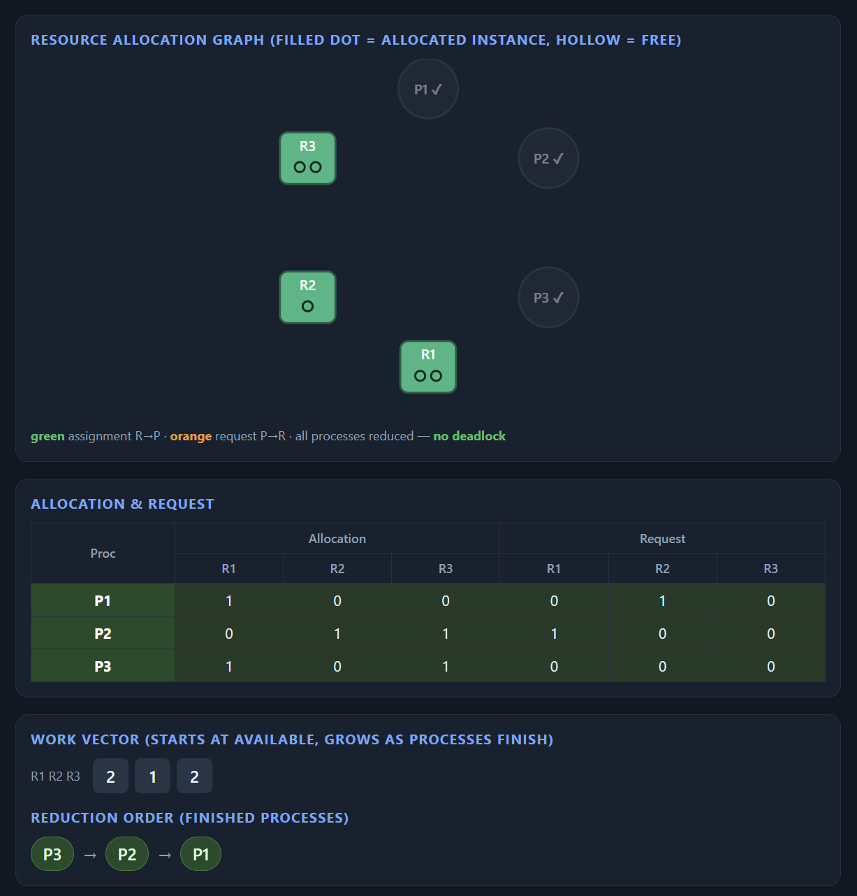
After changing P3's request to 0 1 0 — my prediction + why it deadlocks (reduction terms): my prediction is that it will deadlock because before P3 had no request so it can finish immediately but now it does and the resource it needs has no more avaliable instances so then it turns into a deadlock
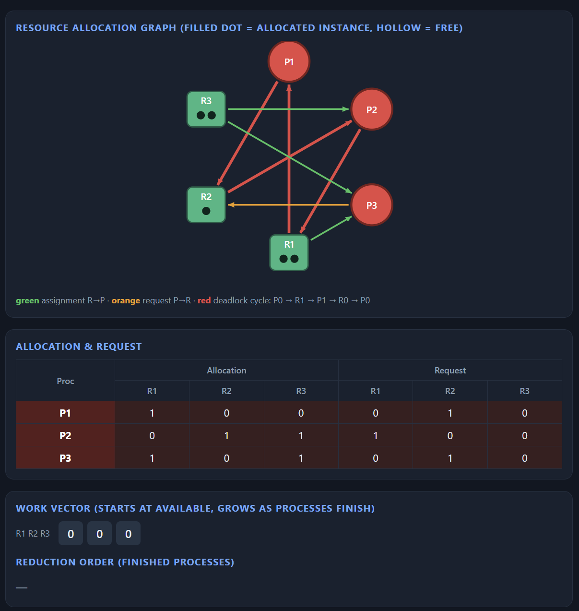

Part B — my own scenario
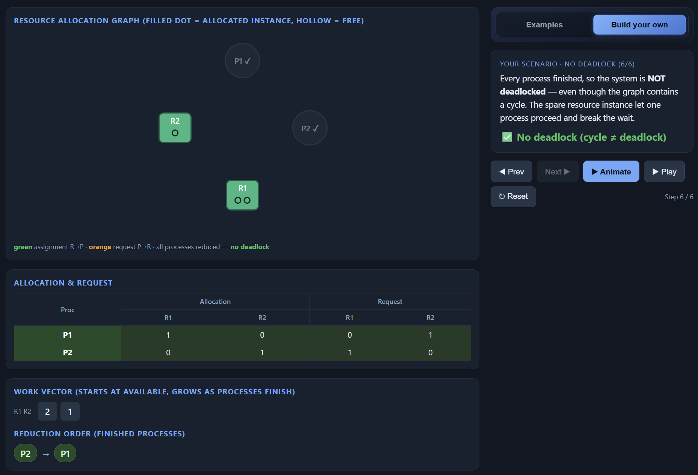
My change that caused deadlock + why (reduction terms): the change i made is that i let R1 instances be from 2 to 1 and it turned deadlocked because before they had an available instance but now that it changed to only one, there's no free instance left so everyone is stuck, causing the deadlock
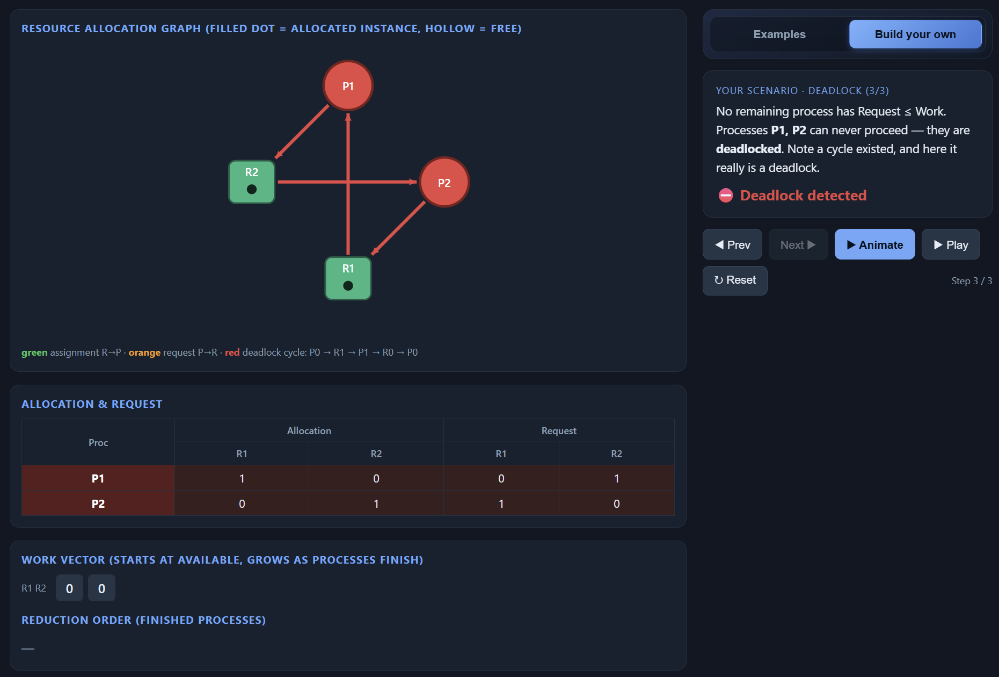

---

## Task 3 — Banker's Algorithm (my personalized scenario)

- Max[P0][A] = 7 + (1 mod 3) = 7 +1 = 8    Max[P2][C] = 2 + (0 mod 4) = 2 + 4 = 6 
- Need matrix: 
        A   B   C
P0      8   4   3
P1      1   2   2
P2      6   0   0
- Available: Total − ΣAlloc = [10 - 5, 5 - 1, 7 - 2] = 5, 4, 5

Safety trace (by hand):

| Step | Process | Why Need ≤ Work | Work after release |
|------|---------|-----------------|--------------------|
| 1 | P1| [1, 2, 2] <= [5, 4, 5]| [7, 4, 5]|
| 2 | P2| [6, 0, 0] <= [7, 4, 5]| [10, 4, 5]|
| 3 | P0| [8, 4, 3] <= [10, 4, 5]| [10, 5, 5]|

Conclusion: SAFE — safe sequence = P1 -> P2 -> P0
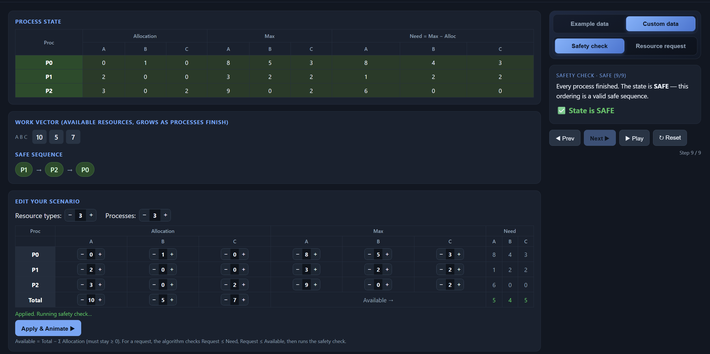
Matched the tool? yes, it matched the tool

Request I predicted GRANTED: P1 requests [1, 0, 0]
- Check 1: request [1, 0, 0] <= need [1, 2, 2] (TRUE)
- Check 2: request [1, 0, 0] <= available [5, 4, 5] (TRUE)
- Check 3: still safe after granting so its granted
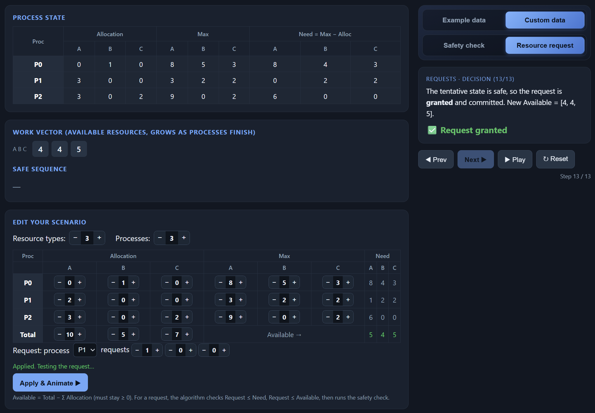

Request I predicted DENIED: P0 requests [6, 0, 0]
- Check 1: request [6, 0, 0] <= need [8, 4, 3] (TRUE)
- Check 2: request [6, 0, 0] <= available [5, 4, 5] (FALSE)
- Denied at check 2
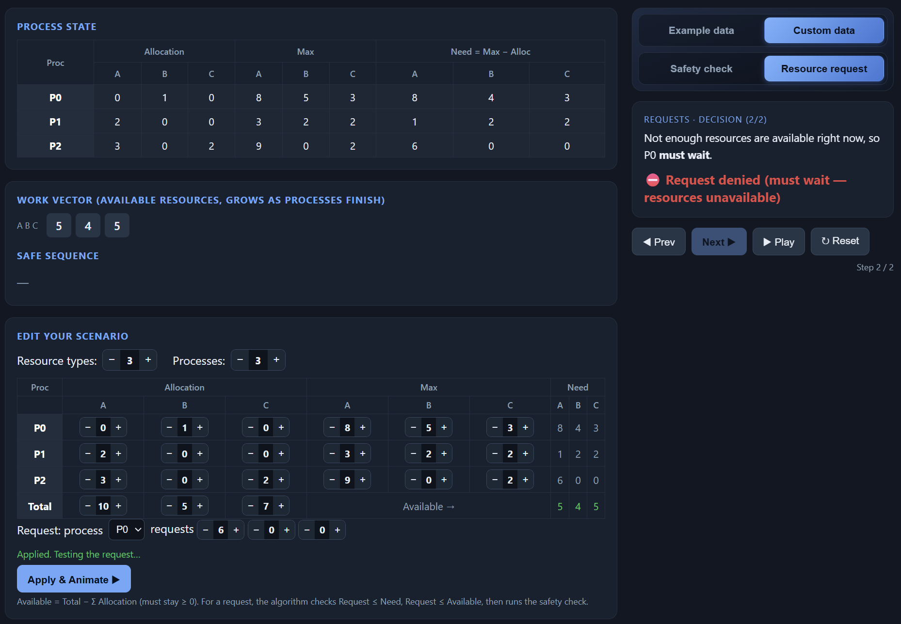

---

## Task 4 — Semaphores and Deadlock

Case 1 (s1=s2=s3=1) — my answer: NO — interleaving + wait-for cycle, or why no cycle can form: because all processes got the semaphore in an ascending order like from 1 -> 2 -> 3 so no circular wait can form and that makes it have no deadlock
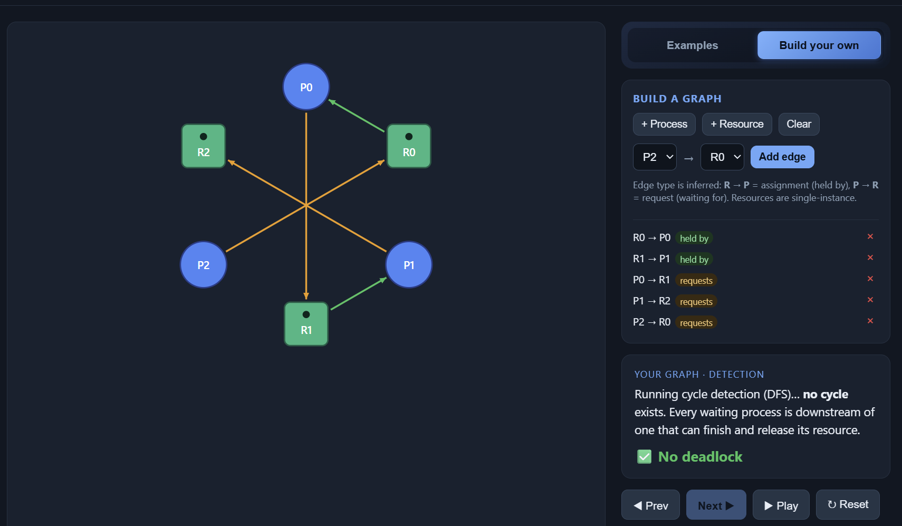
Tool confirmed? yes

Case 2 (s1=s2=s3=1) — my answer: YES — i think it's yes because every process holds a semaphore and it waits for the other thats held by someone else so no one can continue
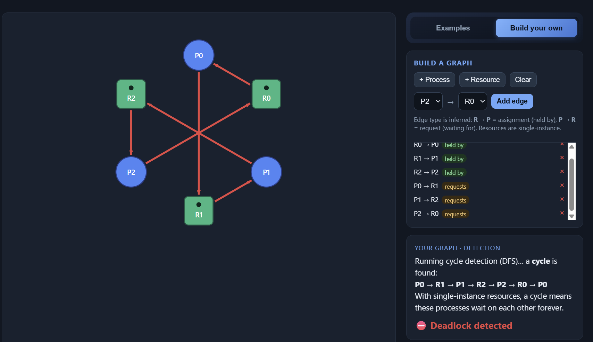
Tool confirmed? yes

Case 3 (s1=2) — my answer: NO — what the extra instance of s1 does: i think the extra instance means that theres no circular wait so theres no cycle that forms
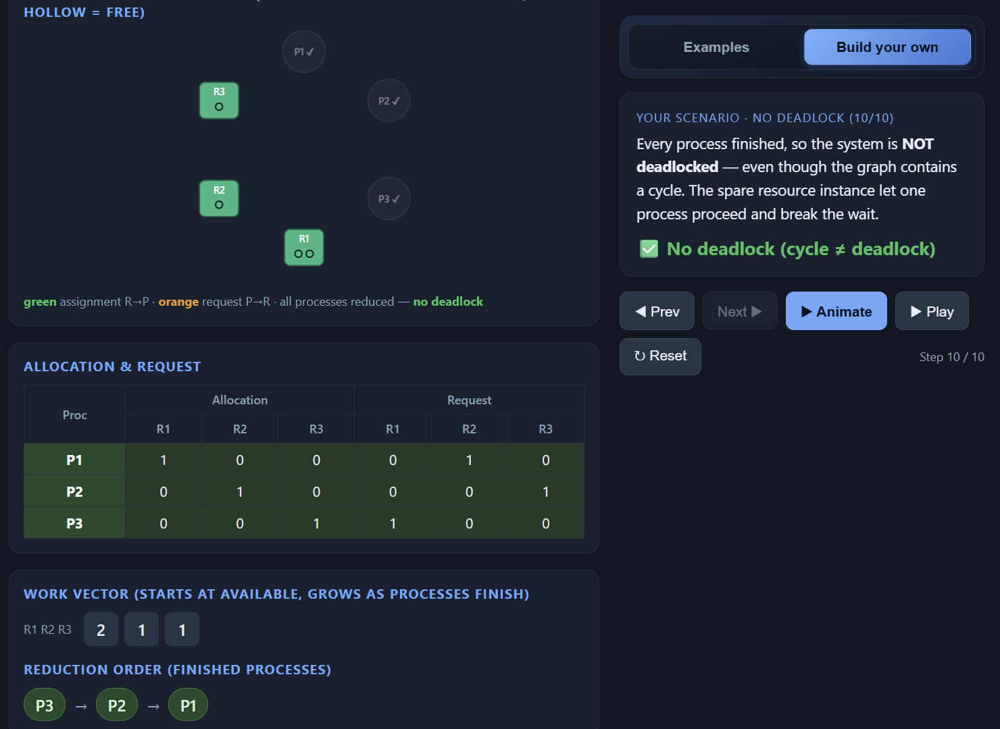
Tool confirmed? yes

---

## Task 5 — Applied Concepts
1. 4 necessary conditions for deadlock using a gaming co-op as an example:
    - mutual exclusion: only one player can use the controller at a time, u can't hold and play at the same time
    - hold and wait: the first player is holding the controller while waiting for the headset and they dont put down the controller yet but they want the headset as well
    - no preemption: we cant just take the headset from someone's head so the other player is the one who decides when they wanna stop using the headset
    - circular wait: player 1 holds the controller and wants the headset while player 2 holds the headset and wants the controller, both are just sitting there waiting for the other to give up their item

    - i think the easiest condition to break is hold and wait since we can just make each player grab both devices before they start or they can put everything down before picking something new up
2. the difference between single-instance and multi-instance is that: in single-instance systems a cycle means deadlock because every process is stuck waiting, but in multi-instance systems, when there is a spare instance, they can let one process finish and break the cycle which does not guarantee deadlock
3. the difference between an unsafe state and a deadlocked state: unsafe just means it might get deadlocked in the future but its not stuck yet while the deadlocked state means the processes are permanently stuck
    - Example: Available = 1 but the remaining process needs 2, so its unsafe but not
deadlocked yet because the process hasn't made the request yet
4. compare deadlock avoidance (Banker's) with deadlock detection + recovery:  Banker's stops deadlock before it happens but wastes resources by being too careful while detection + recovery just lets it happen then kills a process to fix it
5. the Banker's Algorithm require each process to declare its maximum demand in advance because it needs to simulate the worst case to check if everyone can still finish, in real-life, the problem is that most programs don't know their maximum ahead of time, so Banker's is hard to practice and implement

---

## Reflection

_What did this activity teach you about why a cycle does not always mean deadlock, and about the trade-off between deadlock avoidance (Banker's) and detection + recovery in real systems such as databases or operating systems?_

> i think this activity taught me alot more than doing the code version, i am actually thinking and understanding what is going on and how this works because i always thought a cycle means it will cause a deadlock but not in this activity so that's something new i understood