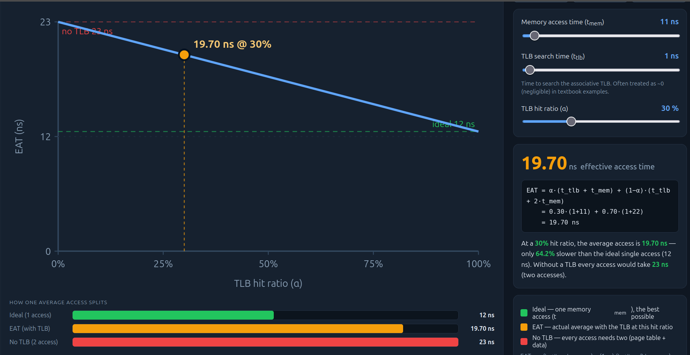
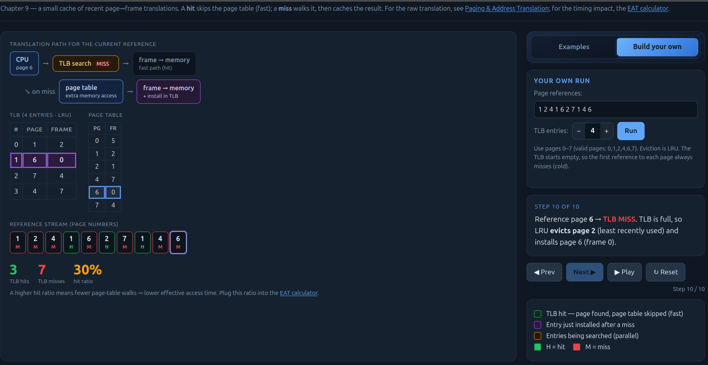
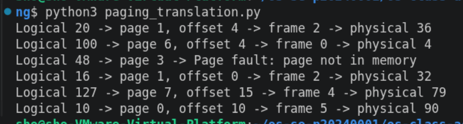
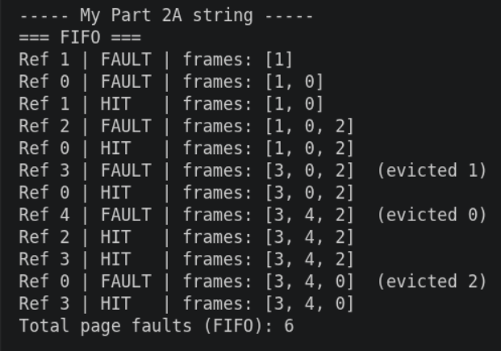
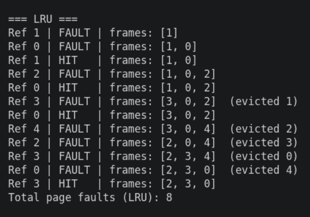

# Class Activity 8 - Memory Management & Virtual Memory

- **Student Name:** Kiv Sovannlyda   **Student ID:** p20240001
- **Personalization:** a = 1, b = 0 → N = (10x1 + 0) mod 128 = 10
- **Programming Language Used:** [...]

## Part 1A — Address translation (by hand)
Personalization: a=9, b=1, N = (10×9+1) mod 128 = 91

| LA  | page = LA÷16 | offset = LA mod 16 | valid? | frame | physical = frame×16+offset |
|-----|-------------|-------------------|--------|-------|---------------------------|
| 20  | 1           | 4                 | YES    | 2     | 2×16+4 = 36               |
| 100 | 6           | 4                 | YES    | 0     | 0×16+4 = 4                |
| 48  | 3           | 0                 | NO     | —     | Page fault                |
| 16  | 1           | 0                 | YES    | 2     | 2×16+0 = 32               |
| 127 | 7           | 15                | YES    | 4     | 4×16+15 = 79              |
| 10  | 0           | 10                | YES    | 5     | 5x16+10 = 90              |

1. Offset unchanged because: the offset just reoresents the specific location of a byte inside a page and since the logical page and physical frame are the same size(16 bytes), nothing changes
2. Largest offset = 15, bits = 4
3. (60 + a) = 61 bytes → 4 pages, internal fragmentation = 3 bytes
   * Bytes needed: 60 + 1 = 61 bytes
   * Pages allocated: 61 / 16 = 4 pages
   * Working: 4 x 16 = 64 bytes allocated => 64 - 61 = 3 bytes wasted

## Part 1B — TLB & Effective Access Time (by hand)
- My page-reference stream: …    Prediction (expected hits): …
[TLB trace table] → measured hits = …/10, α = …
- EAT at my α: … ns   |   EAT at 80% = … |   99% = … |   no TLB = …  (show substitutions)
- Why 99% beats no-TLB by …%: …
   

## Part 1C — Paging simulator verification

- Did the simulator match my 1A table? …
- (Optional) Did the TLB sim reproduce my 1B hit ratio / EAT? …

## Part 2A — Page replacement (by hand)
- My reference string: …    Prediction (FIFO vs LRU): …
[FIFO trace table] → FIFO faults: …
[LRU trace table]  → LRU faults: …
Which faulted more, and did it match my prediction: …

## Part 2B — Demand-paging simulator verification
   
- Did the simulator's counts for my 2A string match my hand totals? … (if not, what was wrong)

## Part 3 — Applied reasoning
1. …  2. …  3. …  4. …  5. …  6. …