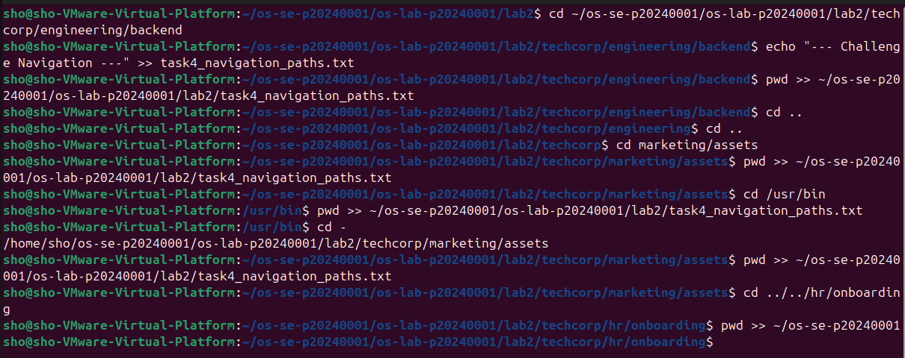
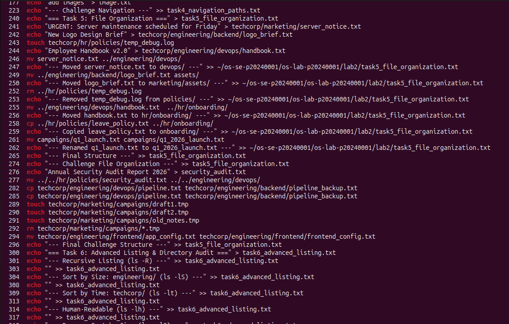
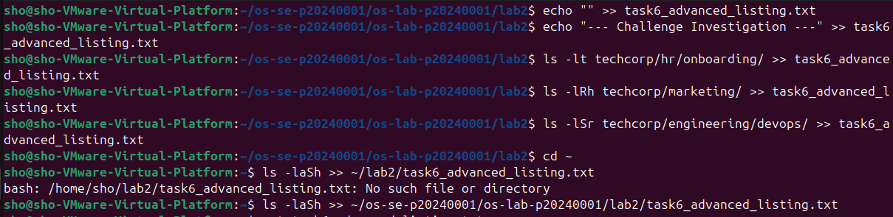
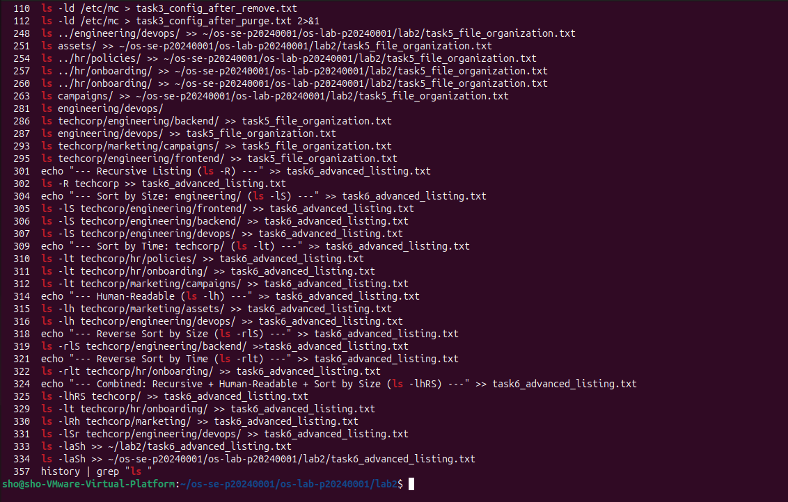
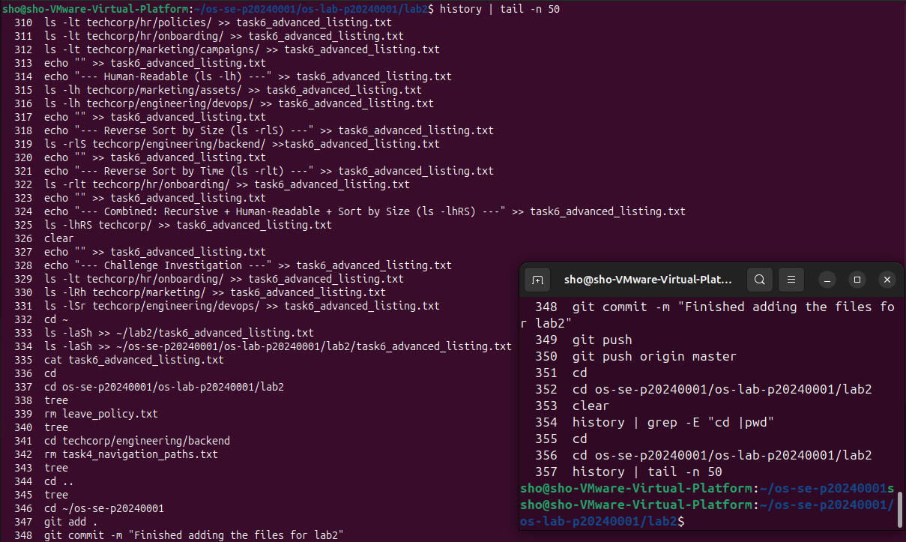

# OS Lab 2 Submission

- **Student Name:** Kiv Sovannlyda
- **Student ID:** p20240001

---

## Task Output Files

During the lab, each task redirected its output into `.txt` files. These files are your primary proof of work for the **guided portions** of each task. Make sure all of the following files are present in your `lab2/` folder:

- `task1_basic_navigation.txt`
- `task2_filesystem_exploration.txt`
- `task3_directory_structure.txt`
- `task4_navigation_paths.txt`
- `task5_file_organization.txt`
- `task6_advanced_listing.txt`

---

## Screenshots

The screenshots below focus on the **Challenge sections** and **command history**, since the guided task outputs are already captured in the `.txt` files above.

---

### Screenshot 1 — Task 4 Challenge Commands

Show the terminal where you ran your own `cd` commands for challenges **8a–8e** (navigating with relative paths, absolute paths, `..`, and `cd -`). This should show both the commands you typed and the `pwd` output after each navigation.

<!-- Insert your screenshot below: -->


---

### Screenshot 2 — Task 4 Challenge History

Run the following command and take a screenshot. This shows the navigation commands you used during the Task 4 challenge.

```bash
history | grep -E "cd |pwd"
```

<!-- Insert your screenshot below: -->


---

### Screenshot 3 — Task 5 Challenge Commands

Show the terminal where you ran your own `mv`, `cp`, `rm`, and rename commands for challenges **9a–9d** (moving, copying, deleting, and renaming files). This should show both the commands you typed and the `ls` output confirming each action.

<!-- Insert your screenshot below: -->


---

### Screenshot 4 — Task 5 Challenge History

Run the following command and take a screenshot. This shows the file management commands you used during the Task 5 challenge.

```bash
history | grep -E "mv |cp |rm |touch |echo "
```

<!-- Insert your screenshot below: -->


---

### Screenshot 5 — Task 6 Challenge Commands

Show the terminal where you ran your own `ls` flag combinations for challenges **6a–6d** (sorting by time, recursive human-readable listing, reverse size sort, and hidden files). This should show both the `ls` commands you chose and their output.

<!-- Insert your screenshot below: -->


---

### Screenshot 6 — Task 6 Challenge History

Run the following command and take a screenshot. This shows the `ls` commands you used during the Task 6 challenge.

```bash
history | grep "ls "
```

<!-- Insert your screenshot below: -->


---

### Screenshot 7 — Full Command History

Run the following command and take a screenshot. This shows the complete trail of commands you executed during the entire lab session.

```bash
history | tail -n 50
```

<!-- Insert your screenshot below: -->


### Folder structure 
After completing the tasks and documentation, my folder structure looks like this:

```
os-se-p20240001
└── os-lab-p20240001
    └── lab2
        ├── images
        │   ├── full_history.png
        │   ├── task4_challenge.png
        │   ├── task4 _history.png
        │   ├── task5_challenge.jpeg
        │   ├── task5_history.png
        │   ├── task6_challenge.png
        │   └── task6_history.png
        ├── README.md
        ├── task1_basic_navigation.txt
        ├── task2_filesystem_exploration.txt
        ├── task3_directory_structure.txt
        ├── task4_navigation_paths.txt
        ├── task5_file_organization.txt
        ├── task6_advanced_listing.txt
        └── techcorp
            ├── engineering
            │   ├── backend
            │   │   ├── app.js
            │   │   ├── database.sql
            │   │   ├── pipeline_backup.txt
            │   │   └── server_config.txt
            │   ├── devops
            │   │   ├── docker-compose.yml
            │   │   ├── Dockerfile
            │   │   ├── pipeline.txt
            │   │   ├── security_audit.txt
            │   │   └── server_notice.txt
            │   └── frontend
            │       ├── frontend_config.txt
            │       ├── index.html
            │       └── styles.css
            ├── hr
            │   ├── onboarding
            │   │   ├── checklist.txt
            │   │   ├── handbook.txt
            │   │   ├── leave_policy.txt
            │   │   └── welcome_guide.txt
            │   └── policies
            │       ├── leave_policy.txt
            │       └── remote_work.txt
            └── marketing
                ├── assets
                │   ├── banner.jpg
                │   ├── brochure.pdf
                │   ├── logo_brief.txt
                │   └── logo.png
                └── campaigns
                    ├── q1_2026_launch.txt
                    └── social_media.txt
```