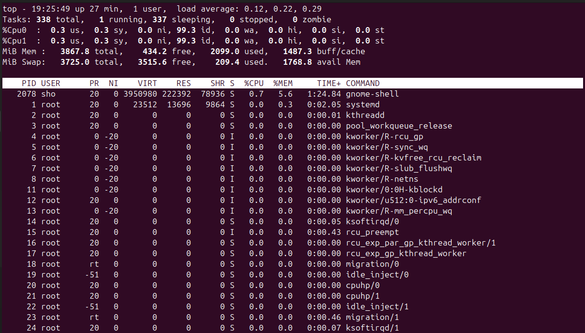
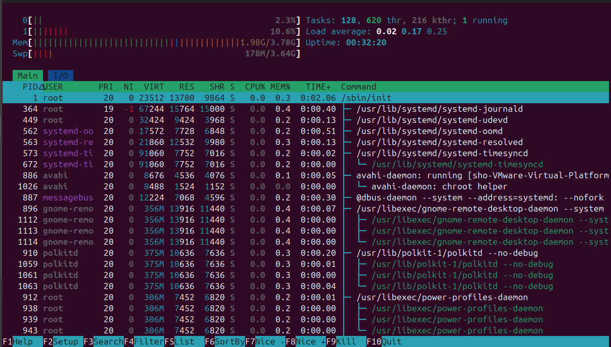
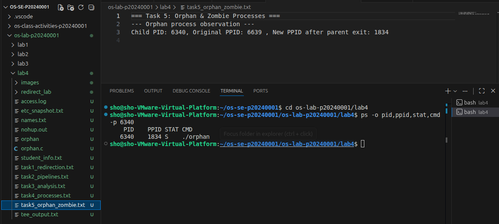
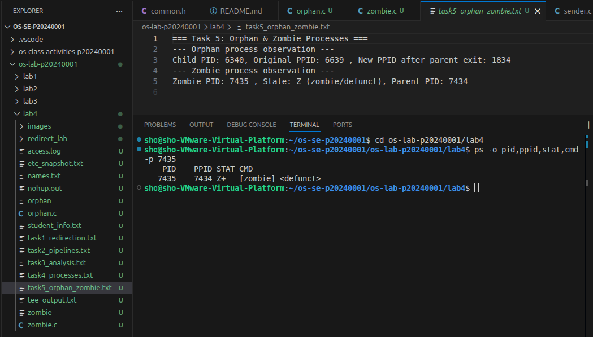

# Lab 4 — I/O Redirection, Pipelines & Process Management

| | |
|---|---|
| **Student Name** | `Kiv Sovannlyda` |
| **Student ID** | `p20240001` |

## Task Completion

| Task | Output File | Status |
|------|-----------|--------|
| Task 1: I/O Redirection | `task1_redirection.txt` | ☐ |
| Task 2: Pipelines & Filters | `task2_pipelines.txt` | ☐ |
| Task 3: Data Analysis | `task3_analysis.txt` | ☐ |
| Task 4: Process Management | `task4_processes.txt` | ☐ |
| Task 5: Orphan & Zombie | `task5_orphan_zombie.txt` | ☐ |

## Screenshots

### Task 4 — `top` Output

### Task 4 — `htop` Tree View

### Task 5 — Orphan Process (`ps` showing PPID = 1)

### Task 5 — Zombie Process (`ps` showing state Z)

## Answers to Task 5 Questions

1. **How are orphans cleaned up?**
   > They get 'adopted' by a system process, like since every child needs a parent, the OS gives them a new one to handle their final exit

2. **How are zombies cleaned up?**
   > The parent process has to acknowledge them by calling wait(). If the parent won't do it, the zombie stays stuck until the parent itself dies

3. **Can you kill a zombie with `kill -9`? Why or why not?**
   > No, a zombie is just a ghost in the process table so in order to get rid of it, you have to kill its parent instead

## Reflection

**_What was the most useful command/technique you learned in this lab? How would you use pipelines and redirection in a real server environment?_**

> The most interesting thing to me honestly was how the parent and child work and are related with the PID, PPID and all. 

> I’d use redirection to save error logs directly to a file so I can check them later and for the pipelines, they are great for filtering massive logs quickly so I don't need to open the whole file to see what's broken.