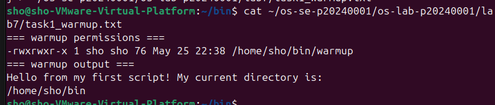
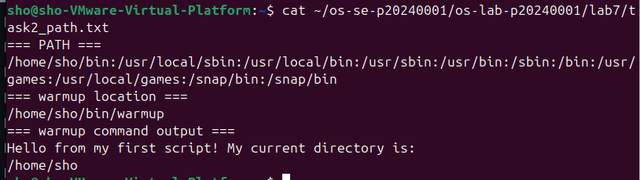
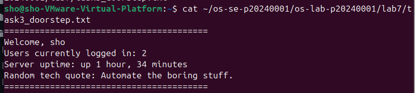
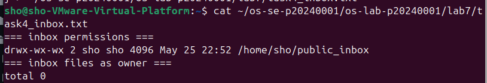
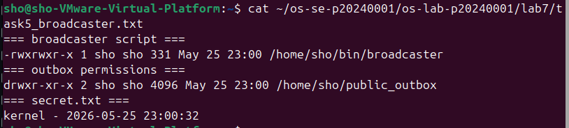
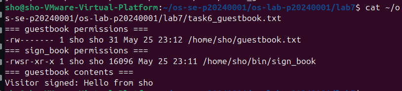
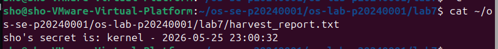
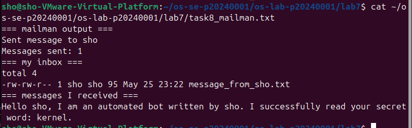

# OS Lab 7 Submission — Bash Scripting, Permissions & Server Automation

- **Student Name:** Kiv Sovannlyda
- **Student ID:** p20240001

---

## Task Output Files

Make sure all of the following files are present in your `lab7/` folder:

- [ ] `task1_warmup.txt`
- [ ] `task2_path.txt`
- [ ] `task3_doorstep.txt`
- [ ] `task4_inbox.txt`
- [ ] `task5_broadcaster.txt`
- [ ] `task6_guestbook.txt`
- [ ] `harvest_report.txt`
- [ ] `task8_mailman.txt`
- [ ] `sign_book.c`
- [ ] `scripts/warmup`
- [ ] `scripts/broadcaster`
- [ ] `scripts/harvester`
- [ ] `scripts/mailman`
- [ ] `scripts/sign_book_binary`

---

## Screenshots

Insert your screenshots below.

### Screenshot 1 — Task 1: Warm-Up Script
Show `cat task1_warmup.txt` with the executable `warmup` script and successful output.

---

### Screenshot 2 — Task 2: PATH Setup
Show `cat task2_path.txt` with your `PATH`, `which warmup`, and running `warmup` by name.

---

### Screenshot 3 — Task 3: Doorstep Message
Show `cat task3_doorstep.txt` with username, users online, uptime, and random quote.

---

### Screenshot 4 — Task 4: Secure Mailbox
Show `cat task4_inbox.txt` with `public_inbox` permissions and a test file from a classmate.

---

### Screenshot 5 — Task 5: Broadcaster
Show `cat task5_broadcaster.txt` with the broadcaster script evidence and `secret.txt`.

---

### Screenshot 6 — Task 6: VIP Guestbook
Show `cat task6_guestbook.txt` with guestbook permissions, SUID binary permissions, and guestbook contents.

---

### Screenshot 7 — Task 7: Data Harvester
Show `cat harvest_report.txt` containing secrets collected from classmates.

---

### Screenshot 8 — Task 8: Mailman Bot
Show `cat task8_mailman.txt` with mailman output and messages received in your inbox.

---

## Answers to Lab Questions

1. **Why did `warmup` fail before you added execute permission?**
   > Linux won't run a file unless it has the execute bit set so without chmod +x, the system just sees it as a plain text file, not something it's allowed to run

2. **What does adding `~/bin` to `PATH` allow you to do?**
   > It lets you run your own scripts by just typing their name from anywhere, without needing to type the full path or ./ every time u try to access it

3. **Why does `chmod 733 public_inbox` allow classmates to drop files but not list the inbox?**
   > The 3 for others gives write and execute permission, but not read, write lets them create files, execute lets them enter the directory, but without read they can't see what's already inside
4. **Why does Linux ignore SUID on shell scripts, and why did we use a compiled C program instead?**
   > Linux intentionally ignores SUID on scripts as a security measure since scripts can be manipulated more easily and we used a compiled C program because a compiled binary is a fixed executable the kernel can trust, so SUID actually works on it

5. **What is the difference between `>` and `>>` in Bash redirection?**
   > > overwrites the file from scratch every time while >> appends to the end of the file, keeping whatever was already there.

6. **How did your `harvester` avoid reading files that were missing or not readable?**
   > It used [ -f "$target_file" ] && [ -r "$target_file" ] to check that the file both exists and is readable before trying to open it; if either check fails, it just skips that user.

7. **What permission problems did you or your classmates need to fix during the lab?**
   > The most common issues were forgetting to set chmod 755 on public_outbox so others could read the secret, and needing chmod 711 on the home directory so they could reach ~/bin/sign_book for the guestbook task

---

## Reflection

> This lab was really complicated about how permission works, i learnt that collaboration on shared server works because of these permission, setting everything up made me think about what permission to give to who and all