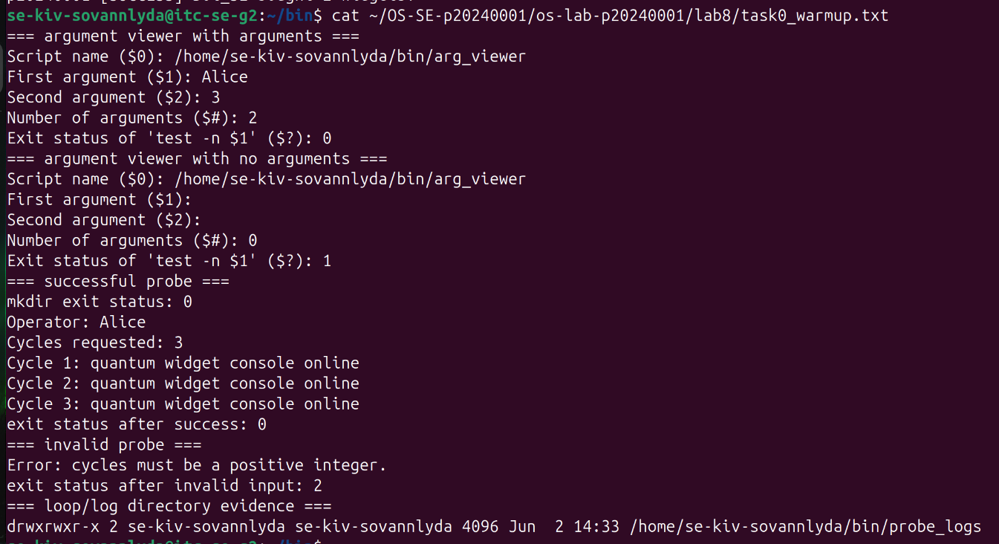
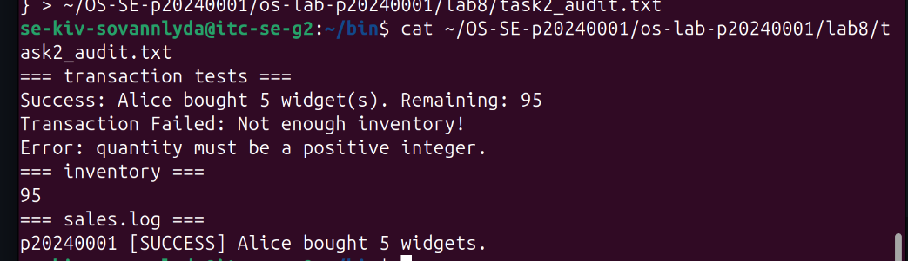
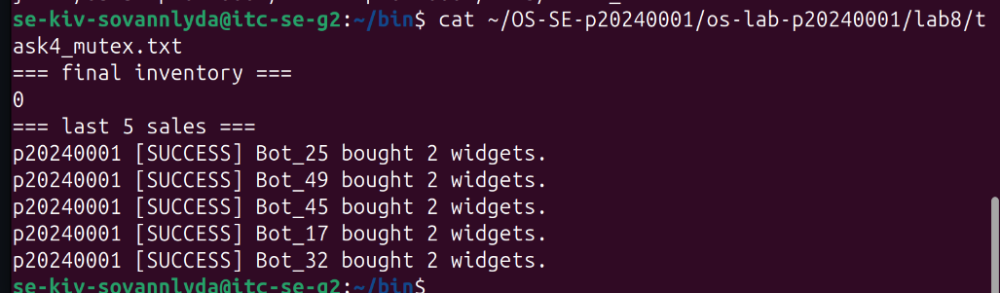
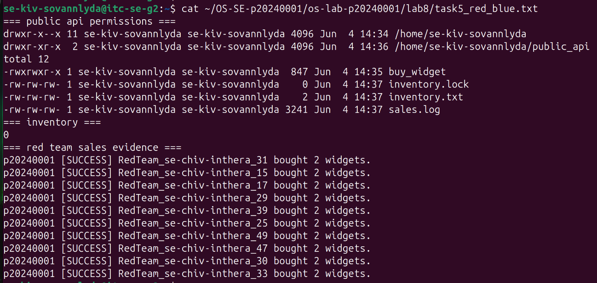
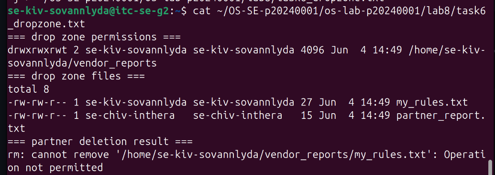
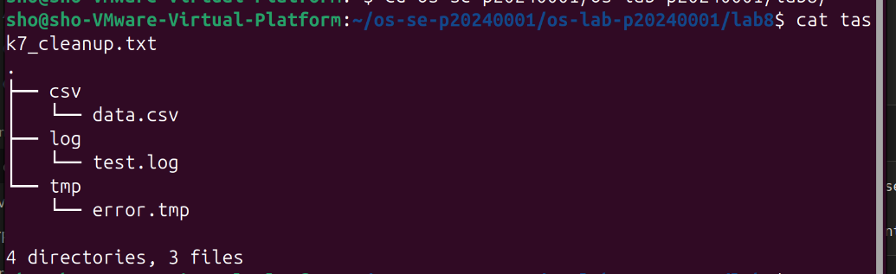

# OS Lab 8 Submission - The Quantum Widget Exploit

- **Student Name:** Kiv Sovannlyda
- **Student ID:** p20240001
- **Partner Username:** Chiv Inthera/ se-chiv-inthera

---

## Task Output Files

Make sure all of the following files are present in your `lab8/` folder:

- [ ] `observations.txt`
- [ ] `task0_warmup.txt`
- [ ] `task1_validation.txt`
- [ ] `task2_audit.txt`
- [ ] `task4_mutex.txt`
- [ ] `task5_red_blue.txt`
- [ ] `task6_dropzone.txt`
- [ ] `task7_cleanup.txt`
- [ ] `scripts/arg_viewer`
- [ ] `scripts/quantum_probe`
- [ ] `scripts/buy_widget`
- [ ] `scripts/bot_swarm`
- [ ] `scripts/create_dropzone`
- [ ] `scripts/cleanup`

---

## Screenshots

Insert your screenshots below.

### Screenshot 1 - Level 0: Bash Warm-Up Scripts
Show `arg_viewer` explaining `$0`, `$1`, `$2`, `$#`, and `$?`, then show `quantum_probe` using a condition and a loop.

---

### Screenshot 2 - Level 2: Audit Trails
Show input validation, a successful sale, failed transactions, final inventory, and `sales.log`.

---

### Screenshot 3 - Level 4: Mutex Patch
Show `inventory.txt` exactly `0` after the patched `bot_swarm`, plus the last five lines of `sales.log`.

---

### Screenshot 4 - Level 5: Red Team vs. Blue Team
Show `public_api` permissions, inventory, and sales log evidence that your classmate executed your API.

---

### Screenshot 5 - Level 6: Secure Drop Zone
Show the sticky bit in `ls -ld` output and evidence that your partner could not delete your file.

---

### Screenshot 6 - Level 7: Forensic Cleanup
Show `tree` or `ls -R` output proving `.log`, `.csv`, and `.tmp` files were sorted into folders.

---

## Race Condition Observations

Summarize your five vulnerable `bot_swarm` runs from `observations.txt`:

| Run | Final Inventory | Notes |
|:---:|----------------:|-------|
| 1 | -2 |  inventory went negative due to race condition         |
| 2 | -2 |  same result so it confirms that the bug is consistent |
| 3 | -2 |  processes overwrote each other's writes               |
| 4 | -2 |  no synchronization so no guranteed correct result     |
| 5 | -2 |  identical result across all the 5 runs                |

---

## Answers to Lab Questions

1. **In `arg_viewer`, what did `$0`, `$1`, `$2`, `$#`, and `$?` mean when you ran the script?**
   > $0 was the script name (arg_viewer), $1 was Alice, $2 was 3, $# was 2 (the number of arguments passed), and $? was 0 because test -n "$1" succeeded since Alice is non-empty

2. **What does TOC-TOU mean, and where did it appear in the vulnerable `buy_widget` script?**
   > it means it is a race condition where the state of a resource changes between when you check it and when you act on it. In buy_widget, multiple bots read the same inventory value before any of them wrote an update back, so they all thought there was enough stock and all proceeded, corrupting the result

3. **Why did `bot_swarm` sometimes leave inventory values other than `0` before the patch?**
   > it does that because multiple processes read the same inventory value at the same time, subtracted independently, and overwrote each other's results,so some sales effectively didn't count, and in our case inventory even went negative.

4. **What part of the script is the critical section, and why must it be protected?**
   > the critical section is the read-check-write block: reading inventory, checking stock, writing the new value, and logging the sale and it must be protected because 2 processes running this simultaneously will both see the same stock and both commit, corrupting the result

5. **How does `flock -x` enforce mutual exclusion between concurrent processes?**
   > it makes a process acquire an exclusive lock before entering the critical section, s any other process trying to grab the same lock is blocked until the first one is done

6. **Which permissions did you use to let a classmate run your API without giving full access to your home directory?**
   > o+x on home for traversal, 755 on public_api, o+rx on the script, and o+rw on the inventory, log, and lock files.

7. **Why does the sticky bit protect files in a shared drop zone?**
   > because without it, anyone with write access to a directory can delete any file in it so it means only the file's owner can delete it.

8. **What defensive scripting practice from this lab would you use in a real production script?**
   > i would validate all input, use flock around shared file access, and anchor file paths with $script_dir so the script behaves the same no matter where it's called from

---

## Reflection

 _What did this lab teach you about the relationship between Bash scripts, OS scheduling, file permissions, and secure concurrent access?_

 > this lab showed me that a script that works fine for one user can completely break under concurrent load like seeing the inventory go negative made the race condition very concrete, and also flock, the sticky bit, and minimal cross-user permissions are all things I'd use in any real scripting work