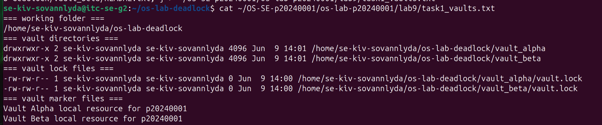
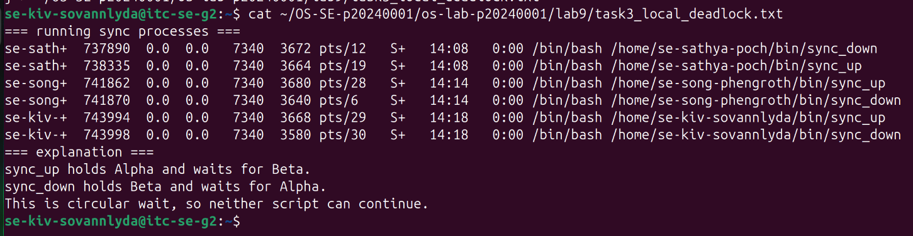
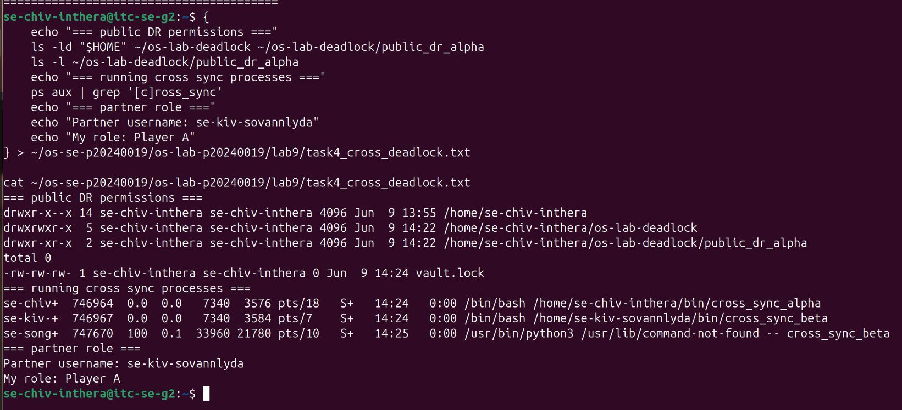
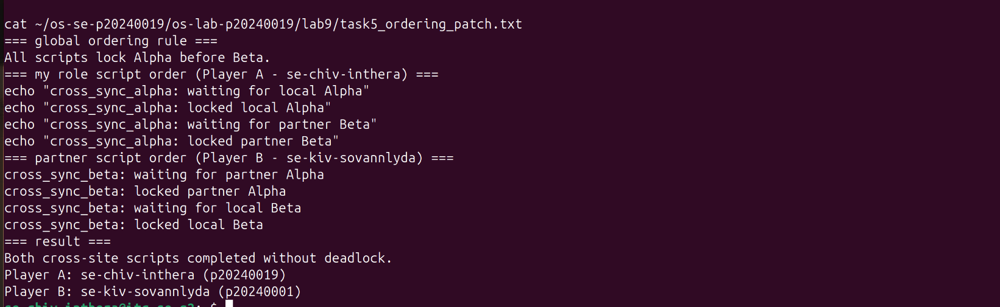
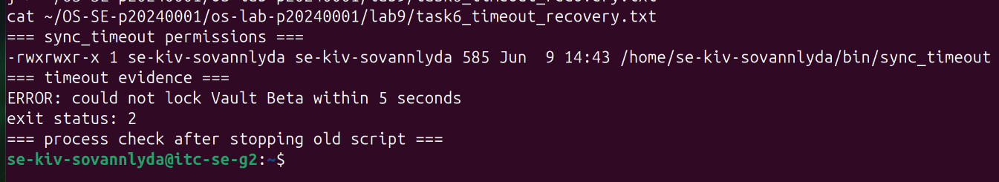
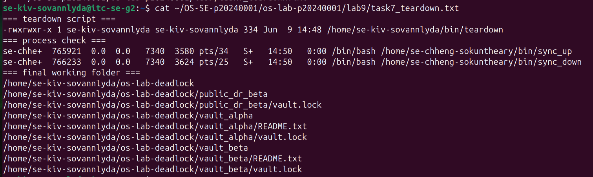

# OS Lab 9 Submission - The Quantum Vault Deadlock

- **Student Name:** Kiv Sovannlyda
- **Student ID:** p20240001
- **Linux Username:** se-kiv-sovannlyda
- **Partner Username:** se-chiv-inthera
- **My Role:** Player B

---

## Required Working Files Outside the Repo

Confirm these files and folders existed while you ran the lab:

- [ ] `~/bin/sync_up`
- [ ] `~/bin/sync_down`
- [ ] `~/bin/sync_timeout`
- [ ] `~/bin/teardown`
- [ ] `~/bin/cross_sync_alpha` OR `~/bin/cross_sync_beta`
- [ ] `~/os-lab-deadlock/README.md`
- [ ] `~/os-lab-deadlock/vault_alpha/README.txt`
- [ ] `~/os-lab-deadlock/vault_alpha/vault.lock`
- [ ] `~/os-lab-deadlock/vault_beta/README.txt`
- [ ] `~/os-lab-deadlock/vault_beta/vault.lock`
- [ ] `~/os-lab-deadlock/public_dr_alpha/vault.lock` OR `~/os-lab-deadlock/public_dr_beta/vault.lock`

---

## Task Output Files

Make sure all of the following files are present in your `lab9/` folder:

- [ ] `task1_vaults.txt`
- [ ] `task2_sync_scripts.txt`
- [ ] `task3_local_deadlock.txt`
- [ ] `task4_cross_deadlock.txt`
- [ ] `task5_ordering_patch.txt`
- [ ] `task6_timeout_recovery.txt`
- [ ] `task7_teardown.txt`
- [ ] `scripts/sync_up`
- [ ] `scripts/sync_down`
- [ ] `scripts/sync_timeout`
- [ ] `scripts/teardown`
- [ ] `scripts/cross_sync_alpha` OR `scripts/cross_sync_beta`

---

## Screenshots

Insert your screenshots below.

### Screenshot 1 - Level 1: Vault Workspace Setup
Show `vault_alpha`, `vault_beta`, and their `vault.lock` files.

---

### Screenshot 2 - Level 3: Local Deadlock
Show frozen `sync_up` and `sync_down` terminals or process evidence.

---

### Screenshot 3 - Level 4: Site-to-Site Deadlock
Show partner cross-site scripts frozen in circular wait.

---

### Screenshot 4 - Level 5: Global Resource Ordering Patch
Show ordered locking completing without deadlock.

---

### Screenshot 5 - Level 6: Timeout Recovery
Show the timeout error and nonzero exit status.

---

### Screenshot 6 - Level 7: Cleanup and Reset
Show the process check and final working tree.

---

## Deadlock Observation Table

| Level | Script A Held | Script A Waited For | Script B Held | Script B Waited For | Result |
|:----:|---------------|---------------------|---------------|---------------------|--------|
| 3 | Vault Alpha | Vault Beta | Vault Beta | Vault Alpha | Deadlock as both scripts froze forever |
| 4 | public_dr_alpha | public_dr_beta | public_dr_beta | public_dr_alpha | Deadlock because both scripts froze forever |
| 5 | public_dr_alpha | public_dr_beta | public_dr_alpha | public_dr_beta | No deadlock because both scripts completed |

---

## Answers to Lab Questions

1. **What does each `vault.lock` file represent in this lab?**
   > It represents a shared resource like only one process can hold it at a time, like a real OS lock
2. **Why does `flock` require every script to lock the same shared file to coordinate correctly?**
   > because both scripts need to point to the same file so the kernel knows they're competing for the same thing so if its different files it means different locks so there's no coordination

3. **In the local deadlock, which resource did `sync_up` hold, and which resource did it wait for?**
   > it held Vault Alpha, waited for Vault Beta

4. **In the local deadlock, which resource did `sync_down` hold, and which resource did it wait for?**
   > it held Vault Beta, waited for Vault Alpha

5. **Which four deadlock conditions were present in Level 3?**
   > Mutual exclusion, Hold and wait, No preemption and Circular wait 

6. **How does the global Alpha-before-Beta ordering rule break circular wait?**
   > if everyone locks Alpha first, nobody can hold Beta and wait for Alpha at the same time so the cycle can't form

7. **Why is `flock -w` useful for recovery even though it does not prevent every deadlock?**
   > because instead of freezing forever, the script gives up after 5 seconds, releases its locks, and exits with an error so the system can recover even if deadlock happens

8. **Why should you check for stuck processes before finishing a deadlock lab?**
   > the stuck script still holds its locks so if you leave it running, future scripts will freeze waiting for those locks too
---

## Reflection

_What did this lab teach you about shared resources, process synchronization, deadlock prevention, and deadlock recovery?_

> in this lab i learnt that deadlock is way easier to understand as i watched both terminals freeze in real time and the fix being as simple as "always lock in the same order" was surprinsing and the timeout approach was useful too but feels more like a backup plan since the deadlock still happens, it just doesn't last forever